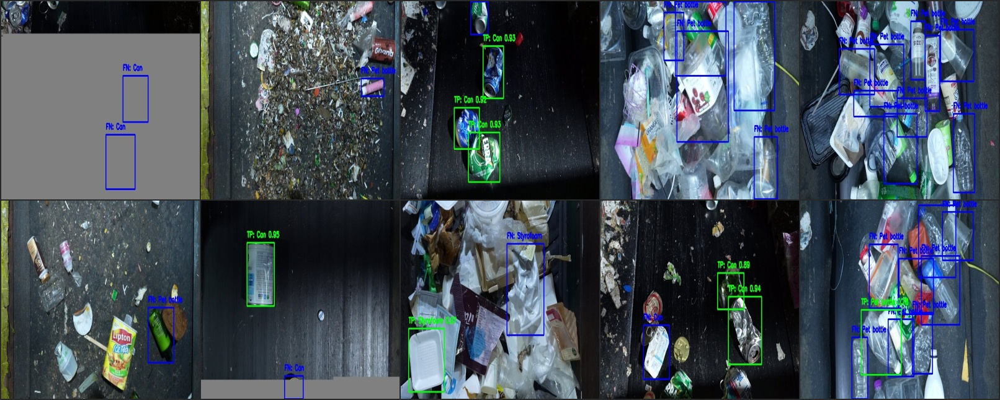
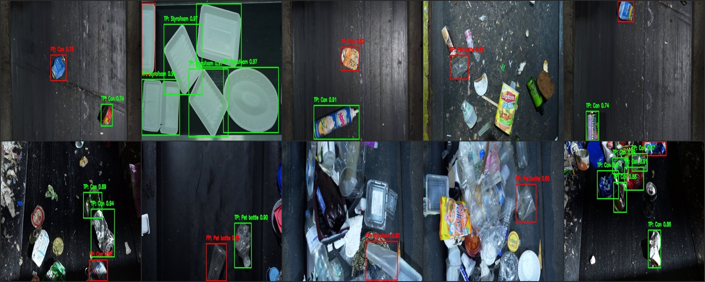
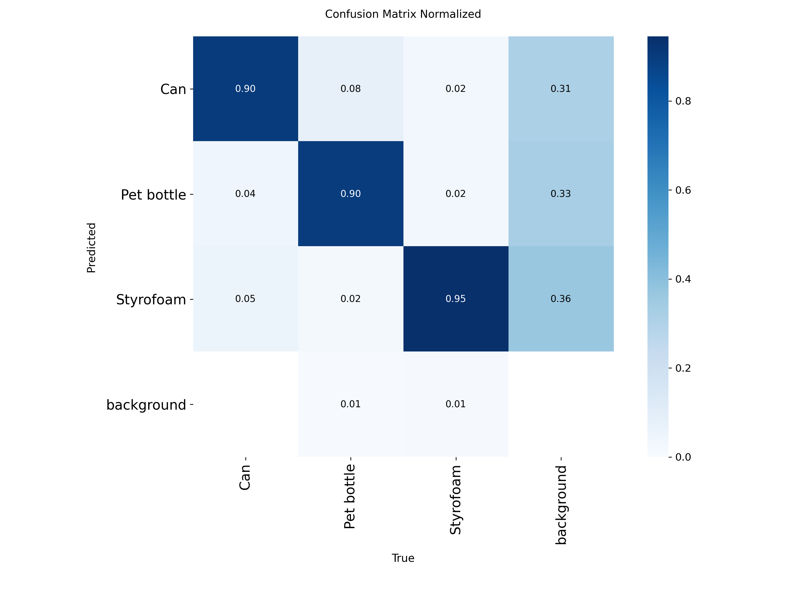
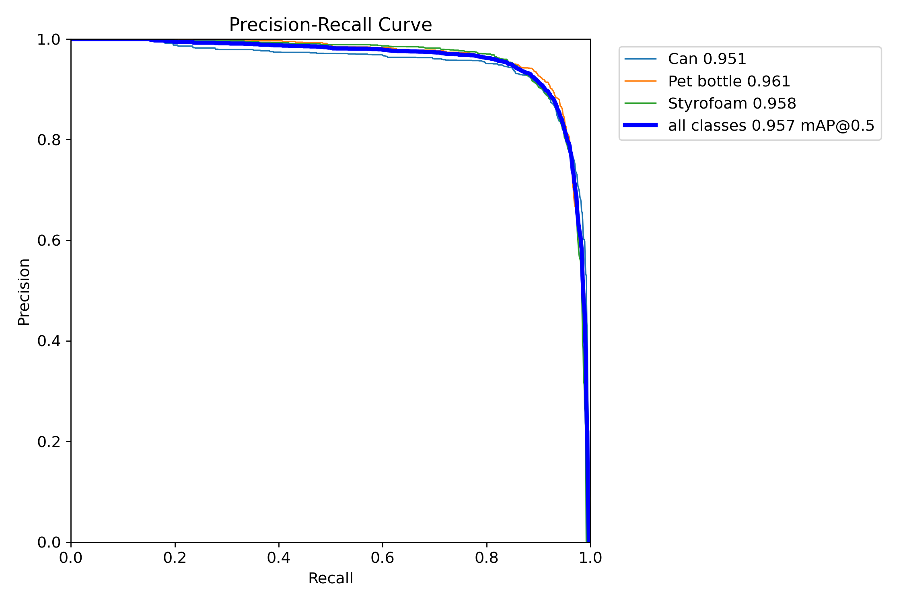

# Model Improvement

## 1. Baseline

### Model

| 항목 | 내용 |
|---|---|
| 모델 | yolo11n.pt (최종 선정) |
| 사전학습 가중치 | ImageNet pretrained |
| 가중치 크기 | 5.2 MB |
| 가중치 경로 | `runs/detect/runs/exp01/hnm_training/weights/best.pt` |

### Hyperparameters

| 항목 | 값 |
|---|---|
| 에폭 | 100 (early stopping patience=20) |
| 배치 크기 | 64 |
| 이미지 크기 | 640 |
| 옵티마이저 | AdamW |
| LR 스케줄러 | Cosine (cos_lr=True) |
| Warmup 에폭 | 3 |
| 데이터 증강 | YOLO default (Mosaic, RandAugment, Erasing 등) |
| 학습 환경 | Google Colab L4 GPU |
| 데이터셋 | 9,999장 (train 7,999 / val 2,000, 80:20 split) |

### Baseline Result

| 지표 | yolov8n (epoch 68) | yolo11n (epoch 81) |
|---|---|---|
| Precision | 0.8053 | 0.8121 |
| Recall | 0.8068 | **0.8164** |
| mAP50 | 0.8665 | **0.8719** |
| mAP50-95 | 0.8014 | **0.8066** |

- **yolo11n**이 yolov8n 대비 전 지표에서 소폭 상회
- 두 모델 모두 mAP50 기준 86% 이상으로 베이스라인 충족
- yolov8n 대비 가중치 크기 및 추론 비용이 더 가벼운 **yolo11n을 최종 모델로 선정**

---

## 2. Performance Analysis

### Metrics

#### Best Epoch 성능 (yolo11n, epoch 81)

| 지표 | 값 |
|---|---|
| Precision | 0.8121 |
| Recall | 0.8164 |
| mAP50 | 0.8719 |
| mAP50-95 | 0.8066 |

#### 클래스별 관찰 사항

- **Can**: 가장 높은 탐지 성능 기록
- **Pet bottle**: 클래스별 탐지 성능이 상대적으로 낮음 (Confusion Matrix에서 정탐지 비율 낮고 배경 오탐지 다수)
- **Styrofoam**: Can과 유사한 수준의 안정적 탐지 성능

### Confusion Matrix


#### 주요 관찰

- **Pet bottle 클래스의 탐지 성능이 상대적으로 낮음**
- 전체 클래스에 대해 **배경(background) 오탐지(False Positive)**가 다수 관찰됨
- Pet bottle의 경우 배경으로 잘못 분류된 케이스가 Can 대비 유난히 많음

### Error Analysis

| FN samples | FP samples |
|---|---|
|  |  |
| 미탐지 샘플 - FN 대표 이미지 (파란색 바운딩 박스) | 오탐지 샘플 - FP 대표 이미지 (빨간색 바운딩 박스) |

#### 분석 내용

- `val` 데이터셋(2000장) 검증 시, 오분류 하는 형태 확인
- 라벨 데이터의 ground truth와 객체 탐지 결과의 pred를 매칭하여 TP, FP, FN 판별
- 분석 스크립트
```bash
python AI/src/analysis/error_analysis.py --model <모델_경로> --conf 0.5 --iou 0.5
```

#### 산출물

| 파일 | 경로 | 설명 |
|---|---|---|
| 오탐지 샘플 | `AI/docs/images/error_analysis/fp_samples/` | FP 대표 이미지 (빨간색 바운딩 박스) |
| 미탐지 샘플 | `AI/docs/images/error_analysis/fn_samples/` | FN 대표 이미지 (파란색 바운딩 박스) |
| 오류 요약 | `AI/docs/images/error_analysis/error_summary.csv` | 이미지별 오류 유형, 클래스, 신뢰도 |

#### 결과

**FN(미탐지) 결과**
| 이미지 번호 | Error 내용 |
|---|---|
| 1번 | 대부분이 가려진 이미지(translate) |
| 2번 | 형태 분류가 어려운 이미지(색상이 흔하지 않은 이미지) |
| 3번 | 가장 자리에 있는 이미지 |
| 4번 | 겹쳐짐이 많은 이미지 |
| 5번 | 겹쳐짐이 많은 이미지 |
| 6번 | 형태 분류가 어려운 이미지(색상이 흔하지 않은 이미지) |
| 7번 | 가장 자리에 있는 이미지, 가려진 이미지 |
| 8번 | 형태 분류가 어려운 이미지(형태 변형이 많이 된 이미지) |
| 9번 | 형태 분류가 어려운 이미지(색상이 흔하지 않은 이미지) |
| 10번 | 겹쳐짐이 많은 이미지 |

**FP(오탐지) 결과**
| 이미지 번호 | Error 내용 |
|---|---|
| 1번 | 라벨링 오류 |
| 2번 | 라벨링 오류 |
| 3번 | 라벨링 오류 |
| 4번 | 형태 분류가 어려운 이미지(질감과 색상이 유사) |
| 5번 | 라벨링 오류 |
| 6번 | 라벨링 오류 |
| 7번 | 라벨링 오류 |
| 8번 | 형태 분류가 어려운 이미지(각진 형태) |
| 9번 | 형태 분류가 어려운 이미지(질감과 색상이 유사) |
| 10번 | 라벨링 오류 |

---

## 3. Problem Definition

### 샘플 이미지에서 발견된 오류 원인 분석

| 원인 | 예시 | 빈도 |
|---|---|---|
| 겹침(Occlusion) | 여러 객체가 겹쳐진 이미지 | 3회 |
| 흔하지 않은 색상/형태 | 색상 변형, 형태 변형 | 4회 |
| 가장자리/잘린 이미지 | 프레임 경계에 위치 | 2회 |
| 가려짐 | 증강 과정 중 부분적으로 숨겨진 객체 | 2회 |
| 라벨링 오류 | 원본 데이터셋 라벨 자체의 문제 | 7회 |
| 질감/색상 유사 | Styrofoam과 Pet bottle의 시각적 유사성 | 3회 |

문제1 : 데이터 자체 오류. 라벨링이 없는 bbox 존재, 일부 가려진 이미지 존재

문제2 : 분류 난이도가 높은 이미지 다수 존재(특이한 색상/형태의 객체)

문제3 : 겹침이 심한 이미지(Pet bottle 클래스)

---

## 4. Root Cause Analysis

### 데이터 자체 오류

**원인 분석 :**
- 라벨링에 실제 객체를 놓친 bbox 존재
- 일부 가려진 이미지 존재

**근거 :**
- 오탐지된 데이터셋의 이미지 직접 확인 : 총 000건 발견

### 분류 난이도가 높은 이미지 다수 존재(Pet bottle 클래스)

**원인 분석 :**
- Pet bottle 클래스에 특이한 색상/형태의 객체 다수 존재

**근거 :**
- Per-class mAP50: Styrofoam (0.932) >  Can (0.924) > Pet bottle (0.76)
- PR curve에서 Pet bottle의 AUC가 가장 낮아 탐지 난이도가 높음을 확인

### 겹침이 심한 이미지(Pet bottle 클래스)

**원인 분석 :**
- 여러 개의 Pet bottle 객체의 bbox가 겹쳐진 형태의 이미지 다수 존재

**근거 :**
- 샘플 Error 이미지 기준 20장 중 3장에서 이러한 경향이 발견됨.
- IoU 0.3을 기준으로, val 2000장 중 19장에서 2개 이상의 Pet bottle bbox가 겹침.
- 겹치는 이미지 비율 0.90%로 매우 낮음.
- 형태가 겹치는 이미지의 비율이 매우 낮기(0.90%)에, 직접적인 원인은 아닌 것으로 보임.

---

## 5. Hypothesis

### 가설1
- Hard Negative Mining 기법 : 분류 실패한 이미지로 데이터셋 구축해 재학습을 시키면 분류 난이도가 높은 이미지에 대한 분류 정확도가 증가할 것이다.

### 가설2 : 
- 클래스별 증강 차등 적용 : Pet bottle 클래스에 색상/형태 변형 데이터를 추가 확보하면 분류 정확도가 향상될 것이다.

---

## 6. Experiment

### Experiment Scenario

#### 관련 논문 및 이론적 근거

**Hard Negative Mining의 이론적 배경**

본 프로젝트에서 적용한 Hard Negative Mining 기법은 이하 논문에서 제안된 Online Hard Example Mining (OHEM)을 기반으로 한다.:

- **논문**: Training Region-based Object Detectors with Online Hard Example Mining
- **저자**: Shrivastava, Gupta, Girshick (CVPR 2016)
- **핵심 주장**: "Detection datasets contain an overwhelming number of easy examples and a small number of hard examples. Automatic selection of these hard examples can make training more effective and efficient."

**논문의 주요 결과**
- PASCAL VOC07: mAP 67.2% → 69.9% (OHEM만 적용 시 +2.7%p)
- PASCAL VOC12: mAP 65.7% → 69.8% (OHEM만 적용 시 +4.1%p)
- Multi-scale + Iterative Bbox Regression와 결합 시 VOC07 78.9% mAP 달성

**본 프로젝트와의 연관성**
- 현재 데이터셋의 Error Analysis 결과, Pet bottle 클래스의 False Negative가 다수 관찰됨
- 이는 논문에서 언급한 "어려운 예시(hard examples)가 소수 존재하는 데이터셋 분포"와 유사
- OHEM 기반 기법을 적용하여 분류 정확도 향상 기대

#### 실험 계획 개요

- HNM 데이터셋은 관련 논문에서 성능 향상이 검증되었으므로 활용
- HNM 적용 상태에서 증강 기법을 각기 다르게 적용하여 최적 조합 도출

| 실험 | 파라미터 | 기본값 | 테스트 값 | 비고 |
| --- | --- | --- | --- | --- |
| Exp02-1 | shear | 0.0 | 5.0 ~ 15.0 | 형태 변형 |
| Exp02-2 | mixup | 0.0 | 0.1 ~ 0.3 | 두 이미지 블렌딩 |
| Exp02-3 | hsv_h| 0.015 | 0.05 ~ 0.25 (0.05 간격으로 실험) | 색상 조정 |
| Exp02-4 | hsv_s | 0.7 | 0.5, 0.7, 1.0 | 채도 조정 |
| Exp02-5 | hsv_v | 0.4 | 0.3, 0.6 | 밝기 조정 |
| Exp02-6 | translate | 0.1 | 0.0, 0.05, 1.0 | 번역 감소 |
| Exp03 | HNM + 개선된 증강 조합 | 최적 조합 도출 (2차 실험) |


### Exp01: Hard Negative Mining

- **목적**: HNM 데이터셋으로 재학습하여 분류 정확도 향상 확인
- **방법**: 
  - HNM 데이터셋으로 재학습 (하이퍼파라미터 동일)
  - Baseline vs HNM 데이터셋 성능 비교
- **결과**: **mAP50-95: 0.898** (Baseline 대비 +11.3%)
- **분석**: 모든 지표에서 10% 이상 개선, 특히 Pet bottle 클래스 개선 폭이 큼

#### HNM Dataset 정보

| 항목 | 값 |
|---|---|
| Train Images | 843 |
| Val Images | 2000 |
| 클래스별 객체 분포 | Can: 469, Pet bottle: 908, Styrofoam: 909 |
| 구조 | images/train, images/val |

#### 결과 비교

| 지표 | Baseline | Exp01 | 개선율 |
|---|---|---|---|
| Precision | 0.8121 | 0.918 | +13.0% |
| Recall | 0.8164 | 0.897 | +9.9% |
| mAP50 | 0.8719 | 0.957 | +9.8% |
| mAP50-95 | 0.8066 | 0.898 | +11.3% |

#### 클래스별 결과

| Class | Precision | Recall | mAP50 | mAP50-95 |
|---|---|---|---|---|
| Can | 0.905 | 0.903 | 0.951 | 0.878 |
| Pet bottle | 0.918 | 0.911 | 0.961 | 0.897 |
| Styrofoam | 0.927 | 0.880 | 0.958 | 0.919 |
| **All** | **0.917** | **0.898** | **0.957** | **0.898** |

#### 혼동행렬


#### PR Curve


### Exp02: 증강 기법별 실험 (취소)

- **목적**: HNM 데이터셋 기반으로 증강 기법별 성능 영향 확인
- **취소 사유**: Exp01 성능이 기대 이상으로 충분하여 Exp02 진행하지 않음
- **원래 계획**: shear, mixup, hsv, translate 등 19회 실험 예정

### Exp03: 증강 조합 실험 (취소)

- **목적**: Exp02에서 개선된 증강을 조합하여 최적 성능 도출
- **취소 사유**: Exp02 취소로 인해 Exp03도 진행하지 않음

---

## 7. Final Model

### 최종 모델 정보

| 항목 | 값 |
|---|---|
| 모델 | yolo11n |
| 가중치 | runs/detect/runs/exp01/hnm_training/weights/best.pt |
| 가중치 크기 | 5.5 MB |
| 학습 데이터 | HNM 데이터셋 (843장) |
| 검증 데이터 | 원본 val set (2000장) |

### 최종 성능

| 지표 | 값 |
|---|---|
| Precision | 0.917 |
| Recall | 0.898 |
| mAP50 | 0.957 |
| mAP50-95 | 0.898 |

### 클래스별 성능

| Class | Precision | Recall | mAP50 | mAP50-95 |
|---|---|---|---|---|
| Can | 0.905 | 0.903 | 0.951 | 0.878 |
| Pet bottle | 0.918 | 0.911 | 0.961 | 0.897 |
| Styrofoam | 0.927 | 0.880 | 0.958 | 0.919 |

### 학습 조건

| 항목 | 값 |
|---|---|
| Epoch | 100 |
| Batch | 64 |
| Image Size | 640 |
| Optimizer | AdamW |
| LR Scheduler | Cosine |
| Warmup Epochs | 3 |
| Early Stopping | patience=20 |
| 학습 환경 | Google Colab T4 GPU |

---