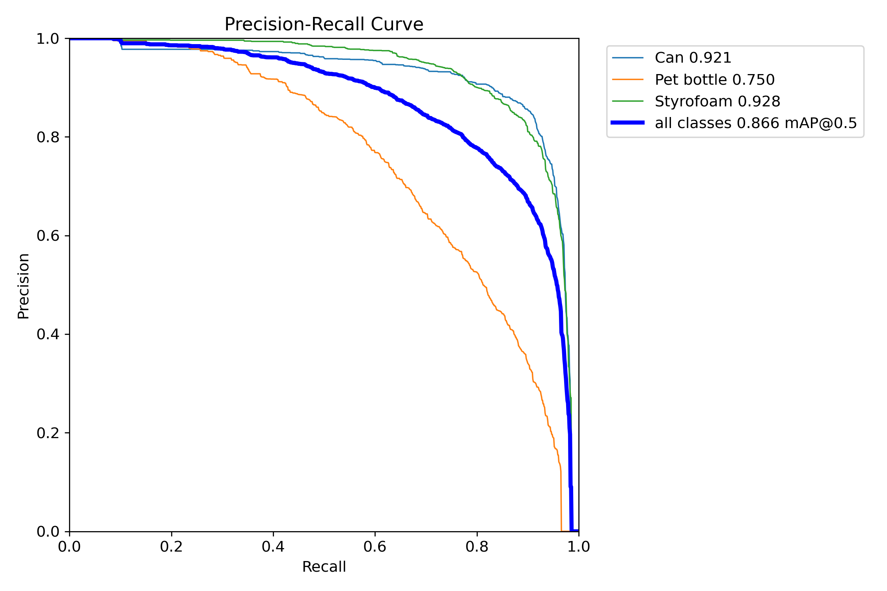
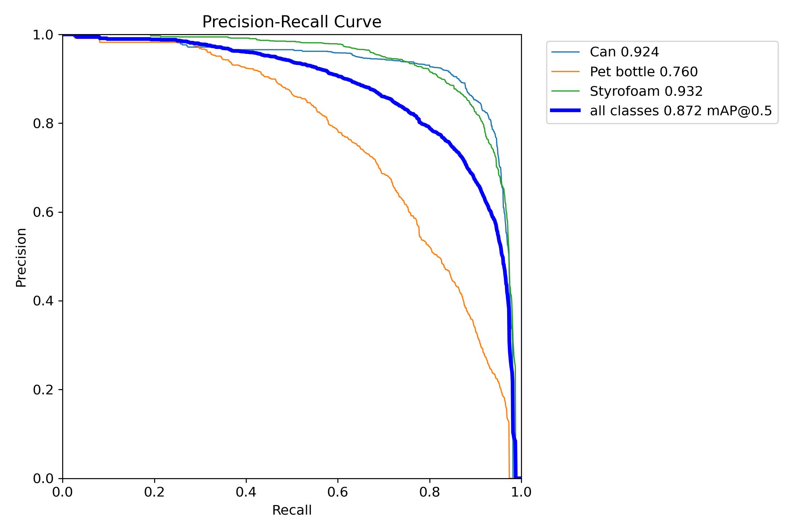
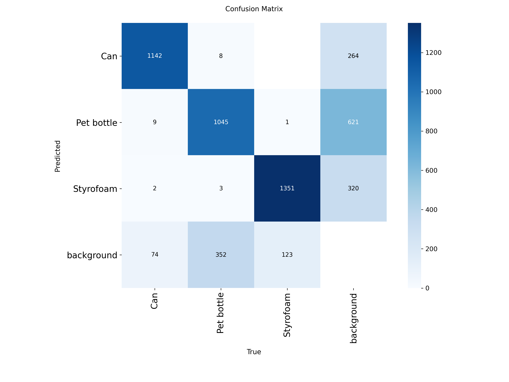

# Week 1 — AI 파트 진행 상황

> **기간**: 2026.07.03 ~ 2026.07.08  
> **목표**: 베이스라인 데이터셋 구축 + YOLO 모델 학습 + 실시간 비전 파이프라인 완성

---

## 1. 데이터셋 구축

| 항목 | 내용 |
|---|---|
| 출처 | AIHub (재활용품 분류 및 선별 데이터) |
| 클래스 | 3종 — Can, Pet bottle, Styrofoam |
| 전체 장수 | 9,999장 |
| 분할 비율 | train 8 : val 2 |
| 경로 | `AI/data/dataset/` |
| 구조 | `AI/data/dataset/data.yaml` |
| 링크 | ([Google Drive](https://drive.google.com/file/d/1YwxGctreCivOjuJ5DvqFp6z17AK1IuOL/view?usp=drive_link))

```yaml
# data.yaml
path: AI/data/dataset
train: images/train
val: images/val
nc: 3
names:
  0: Can
  1: Pet bottle
  2: Styrofoam
```

---

## 2. YOLO 모델 1차 학습

### 학습 설정

| 항목 | 값 |
|---|---|
| 모델 | yolov8n.pt, yolo11n.pt |
| 에폭 | 100 (early stopping patience=20) |
| 배치 크기 | 64 |
| 이미지 크기 | 640 |
| 옵티마이저 | AdamW |
| LR 스케줄러 | Cosine (cos_lr=True) |
| 데이터 증강 | YOLO default(Mosaic, RandAugment, Erasing 등) |
| GPU | Colab L4 |

### 학습 결과

| 모델 | 가중치 크기 | 가중치 경로 |
|---|---|---|
| yolov8n | 6.0 MB | `runs/detect/runs/train_full/yolov8n/weights/best.pt` |
| yolo11n | 5.2 MB | `runs/detect/runs/train_full/yolo11n/weights/best.pt` |

### 산출물
- `train.py` - YOLO 모델 학습 코드
- `results.png`, `BoxPR_curve.png`, `confusion_matrix.png` 등 성능 그래프
- `args.yaml` — 학습 하이퍼파라미터 기록

---

## 3. 실시간 비전 파이프라인

### 구조
```
입력(웹캠/파일) → YOLO 추론 → 바운딩박스 → 출력
```

### 파일
- `AI/src/inference/detect_realtime.py`

### 기능
| 기능 | 설명 |
|---|---|
| 입력 | 웹캠(기본) 또는 동영상 파일 |
| 추론 | YOLO 기반 객체 탐지(3 클래스 분류 및 탐지) |
| 출력 | 바운딩 박스 시각화 (실시간 화면) |
| 설정 | argparse → `--model`, `--source`, `--conf`, `--iou`, `--imgsz` |

### 실행 방법
```bash
python AI/src/inference/detect_realtime.py --model runs/detect/runs/train_full/yolov8n/weights/best.pt
```

### 출력 데이터 구조

| 필드 | 타입 | 예시 |
|---|---|---|
| class_name | str | `"Can"` |
| confidence | float | `0.92` |
| bbox (xyxy) | (int, int, int, int) | `(100, 50, 200, 150)` |


---

## 4. 학습 결과 분석

### Best Epoch 성능 비교

| 지표 | yolov8n (epoch 68) | yolo11n (epoch 81) |
|---|---|---|
| Precision | 0.8053 | 0.8121 |
| Recall | 0.8068 | **0.8164** |
| mAP50 | 0.8665 | **0.8719** |
| mAP50-95 | 0.8014 | **0.8066** |

- **yolo11n**이 전반적으로 yolov8n 대비 소폭 높은 성능 기록(미세한 차이)
- 두 모델 모두 mAP50 기준 86% 이상으로 베이스라인 충족
- 일반적으로 원본과 최적화 시에도 더 가벼운 **yolo11n**를 최종 모델로 사용하는 것을 제안

### Precision-Recall Curve

| yolov8n | yolo11n |
|---|---|
|  |  |

### Confusion Matrix

| yolov8n | yolo11n |
|---|---|
|  |  |

- 두 모델에서 공통적으로 **Pet bottle 클래스의 탐지 성능이 상대적으로 낮게** 관찰됨.
- 전체 클래스에 대해, 배경(background) 오탐지(false positive)가 문제로 보임(*배경을 객체로 인식*)

### 문제점 및 가설

#### Pet bottle 클래스 탐지 성능이 떨어짐.

**근거**: Confusion Matrix에서 Pet bottle의 정탐지(True Positive) 비율이 Can 대비 낮고, 배경(background)으로 잘못 분류된 케이스가 다수 관찰됨.

**가설**
1. 형태 다양성 — 페트병은 색상(투명/파랑/초록), 형태(구부러짐, 찌그러짐), 라벨 유무 등 intra-class variation이 큼
2. 겹침 문제 — 데이터셋에 객체 간 겹침이 많은 이미지가 다수 포함되어 있어 탐지 난이도가 높음

**해결 방안**
- Pet bottle 클래스에 데이터 증강(색상 변환, 형태 왜곡) 집중 적용
- Hard Negative Mining(학습/검증 과정에서 틀린 이미지를 학습 데이터에 추가해 재학습 진행)
- Confidence Threshold 조정(배경을 오탐하는 비율이 특히 많은 것으로 보아 비교적 높은 값 넣어서 비교)

#### 배경을 객체로 오탐지 (False Positive)

**근거**: Confusion Matrix의 background 열에서 일부 오탐지 확인.

**가설**
- 배경에 Can/Pet bottle과 유사한 텍스처나 원형 패턴이 존재
- 학습 데이터의 배경 다양성 부족

**해결 방안**
- 데이터 증강 중 CutOut/RandErasing으로 배경 일반화 능력 향상
