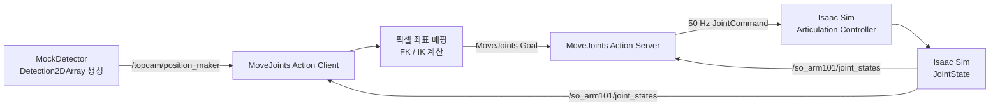

# SO-ARM101 ROS 2 · Isaac Sim 제어

상부 카메라에서 검출한 객체의 픽셀 좌표를 로봇의 관절 목표값으로 변환하고, ROS 2 액션을 통해 Isaac Sim의 SO-ARM101을 이동시키는 기본 기능 구현 프로젝트입니다.

현재 구현은 Mock 객체 검출 데이터 생성부터 픽셀 좌표 매핑, URDF 기반 FK/IK, 액션 Goal 전송, 6축 관절 보간 및 Isaac Sim 이동까지 확인한 상태입니다. 실제 객체 작업 완료에 필요한 목표 도달 판정, Z축 하강, 그리퍼 열기·닫기는 아직 구현되지 않았습니다.

## 전체 동작 구조



```text
Mock 객체 검출
→ 첫 번째 객체의 bbox 중심 픽셀 추출
→ 픽셀 좌표를 현재 end-effector 기준 상대 XY 이동량으로 변환
→ 현재 관절 상태로 FK 계산
→ 목표 XYZ에 대한 IK 계산
→ 6축 MoveJoints Goal 전송
→ 현재 관절값과 목표값 사이를 5차 smoothstep으로 보간
→ Isaac Sim에 50 Hz로 JointCommand 발행
→ SO-ARM101 이동
```

## 코드 구조와 역할

```text
ws_controlrobots/
├── _docs/
│   ├── 1. 설계로직 정리.md
│   ├── 2. 시뮬레이션 시나리오 설계.md
│   ├── 3. 개발항목 리스트.md
│   └── 4. 4주차 작업내역.md
├── src/
│   ├── so_arm101_control_pkg/
│   │   ├── so_arm101_control_pkg/
│   │   │   ├── detector.py
│   │   │   ├── kinematics.py
│   │   │   ├── move_joints_action_client.py
│   │   │   └── move_joints_action_server.py
│   │   └── test/
│   ├── so_arm101_description/
│   │   └── urdf/
│   │       ├── so_arm101.urdf
│   │       └── assets/
│   └── so_arm101_interface_pkg/
│       └── action/
│           └── MoveJoints.action
└── README.md
```

### `so_arm101_control_pkg`

ROS 2 노드와 좌표·관절 계산 코드를 포함합니다.

#### `detector.py`

- `MockDetector` 노드 제공
- 실제 YOLO 대신 임의의 객체 1~3개 생성
- 객체 중심 좌표, `80 × 80` bbox, class, confidence 생성
- `vision_msgs/Detection2DArray` 형식 사용
- `/topcam/position_maker` 토픽에 기본 10초 주기로 발행
- `interval` ROS 파라미터로 발행 주기 변경 가능
- 좌표 변환과 IK는 수행하지 않고 검출 정보만 발행

#### `move_joints_action_client.py`

- `/topcam/position_maker`의 Detection 메시지 구독
- `/so_arm101/joint_states`의 실제 관절 상태 구독
- Detection 배열의 첫 번째 객체 처리
- bbox 중심 픽셀을 현재 end-effector 기준 상대 XY 이동량으로 변환
- 초기 시험 안전 범위로 X와 Y 이동량을 각각 `±0.05 m`로 제한
- 현재 관절 상태로 FK 계산
- 목표 XYZ에 대한 위치 IK 계산
- 5개 팔 관절의 IK 결과에 현재 gripper 값을 추가
- `move_joints_action` 액션 서버에 6축 Goal 전송
- Goal 실행 중 새 Detection은 보관하지 않고 무시

현재 픽셀 매핑은 다음 설정을 사용합니다.

```text
이미지 크기: 640 × 480
테이블 X 크기: 0.8085078 m
테이블 Y 크기: 1.1356210 m
이미지 위쪽: World +X
이미지 왼쪽: World +Y
```

```python
robot_x_offset = (240 - pixel_y) * (0.8085078 / 480)
robot_y_offset = (320 - pixel_x) * (1.1356210 / 640)
```

#### `kinematics.py`

- `so_arm101.urdf` 파싱
- `base_link`에서 `gripper_frame_link`까지의 관절 체인 구성
- 현재 관절값을 이용한 Forward Kinematics 계산
- 목표 XYZ에 대한 위치 Inverse Kinematics 계산
- URDF 관절 제한값을 IK 범위로 사용
- 그리퍼 관절은 팔 IK 계산에서 제외

현재 IK는 end-effector의 XYZ 위치만 계산합니다. Orientation, 자기 충돌, 환경 충돌 및 경로 충돌은 검사하지 않습니다.

#### `move_joints_action_server.py`

- `move_joints_action` 액션 서버 제공
- `/so_arm101/joint_states`에서 최신 관절값 수신
- Goal의 관절 이름, 위치 개수 및 이동시간 검증
- 실제 현재 관절값을 보간 시작점으로 사용
- 6개 관절을 동일한 진행률로 동시에 이동
- 5차 smoothstep으로 중간 관절 좌표 계산
- `/so_arm101/joint_command`에 `50 Hz`로 보간값 발행
- 실제 JointState를 액션 feedback과 result에 포함
- 액션 취소 요청 수락 및 명령 반복 중단
- `MultiThreadedExecutor(num_threads=2)`로 액션 실행과 JointState 수신 분리

보간식은 다음과 같습니다.

```python
progress = step / total_steps
alpha = 10 * progress**3 - 15 * progress**4 + 6 * progress**5
command = start + alpha * (target - start)
```

현재 서버는 지정된 duration 동안 보간 명령 발행을 마치면 성공을 반환합니다. 실제 관절값이 목표 허용오차에 들어왔는지는 아직 판정하지 않습니다.

### `so_arm101_description`

- SO-ARM101 URDF와 STL mesh 제공
- IK와 관절 정보의 기준 모델로 사용
- 기준 링크: `base_link`
- end-effector 링크: `gripper_frame_link`

사용하는 관절 순서는 다음과 같습니다.

```text
shoulder_pan
shoulder_lift
elbow_flex
wrist_flex
wrist_roll
gripper
```

### `so_arm101_interface_pkg`

클라이언트와 서버가 사용하는 `MoveJoints.action`을 제공합니다.

```text
# Goal
sensor_msgs/JointState target_state
builtin_interfaces/Duration duration
---
# Result
bool success
string message
sensor_msgs/JointState final_state
---
# Feedback
float32 progress
sensor_msgs/JointState current_state
```

## ROS 2 인터페이스

| 구분 | 이름 | 타입 | 발행 | 구독 |
|---|---|---|---|---|
| Topic | `/topcam/position_maker` | `vision_msgs/Detection2DArray` | MockDetector | Action Client |
| Topic | `/so_arm101/joint_states` | `sensor_msgs/JointState` | Isaac Sim | Action Client, Action Server |
| Topic | `/so_arm101/joint_command` | `sensor_msgs/JointState` | Action Server | Isaac Sim |
| Action | `/move_joints_action` | `so_arm101_interface_pkg/action/MoveJoints` | Action Server | Action Client |

## 시나리오 구현 단계

진행률은 각 단계의 완료 체크 항목 수를 전체 체크 항목 수로 나눈 값입니다. 구현 난이도 가중치는 적용하지 않았습니다.

| 단계 | 개발 과정 | 완료 항목 | 진행률 | 현재 판단 |
|---:|---|---:|---:|---|
| 1 | 객체 검출 데이터 생성 | 4/6 | 67% | Mock 입력 구현 |
| 2 | Detection 검증 및 객체 선택 | 3/7 | 43% | 첫 번째 객체만 처리 |
| 3 | 픽셀 좌표와 로봇 좌표 매핑 | 5/10 | 50% | 임시 상대 XY 매핑 |
| 4 | 로봇 모델 및 FK/IK | 5/9 | 56% | 위치 IK까지 구현 |
| 5 | 액션 클라이언트와 Goal 관리 | 7/9 | 78% | 단일 객체 Goal 구현 |
| 6 | 액션 서버와 관절 이동 | 8/12 | 67% | 보간 이동 구현 |
| 7 | Isaac Sim 연동 | 7/8 | 88% | 부드러운 6축 이동 확인 |
| 8 | 객체 접근 및 작업 완료 | 1/7 | 14% | 접근 이동까지만 확인 |
| 9 | 여러 객체와 작업 주기 | 1/7 | 14% | 실행 중 입력 무시만 구현 |
| 10 | 실패·취소·복구 | 1/8 | 13% | 취소 요청 수락만 구현 |
| 11 | 시험 및 검증 | 6/11 | 55% | 기본 이동 파이프라인 확인 |
| **전체** | **전체 시나리오 체크 항목** | **48/94** | **51%** | **기본 이동 기능 구현 단계** |

각 단계의 요구사항, 고려사항 및 완료 조건은 [시뮬레이션 시나리오 설계 문서](./_docs/2.%20시뮬레이션%20시나리오%20설계.md)에 정리되어 있습니다.

현재 구현 범위는 다음과 같습니다.

```text
Detection 생성
→ 픽셀 좌표 매핑
→ FK / IK
→ MoveJoints Goal
→ 6축 보간
→ Isaac Sim 이동
```

현재 미구현 범위는 다음과 같습니다.

```text
실제 목표 도달 확인
→ 객체 허용 반경 확인
→ Z축 하강
→ 그리퍼 열기
→ 그리퍼 닫기
→ 객체 작업 완료 판정
```

## 환경 및 의존성

개발 및 확인 환경:

- ROS 2 Jazzy
- Isaac Sim 6.0.1
- Python 3
- NumPy
- SciPy
- ROS 2 패키지: `rclpy`, `rcl_interfaces`, `ament_index_python`, `builtin_interfaces`, `sensor_msgs`, `vision_msgs`

## 빌드

워크스페이스 최상위에서 다음 명령을 실행합니다.

```bash
source /opt/ros/jazzy/setup.bash
colcon build --symlink-install
source install/setup.bash
```

Python 소스만 수정한 경우 `--symlink-install` 빌드 이후에는 파일을 저장하고 실행 중인 노드를 재시작하면 변경 내용이 반영됩니다. `setup.py`, `package.xml`, `CMakeLists.txt`, URDF 또는 Action 인터페이스를 변경한 경우에는 다시 빌드해야 합니다.

## Isaac Sim 설정

URDF를 USD로 import할 때 다음 설정이 필요합니다.

```text
Base Type = Fixed
```

각 구동 Joint의 Drive 값은 다음과 같이 설정했습니다.

```text
Max Force = 10000
Stiffness = 100000
Damping = 1000
```

Isaac Sim의 Action Graph는 다음 ROS 2 토픽을 연결해야 합니다.

```text
/so_arm101/joint_states
/so_arm101/joint_command
```

Action Graph에 동일한 Articulation을 제어하는 명령 경로가 중복되면 ROS 명령과 기존 목표값이 번갈아 적용되어 로봇이 떨릴 수 있습니다. 이 프로젝트에서도 떨림 원인은 액션 서버의 보간이 아니라 Isaac Sim Action Graph 구성이었습니다.

## 실행

Isaac Sim에서 SO-ARM101 USD와 ROS 2 Action Graph를 열고 Timeline을 재생한 뒤, 각각 별도의 터미널에서 실행합니다.

### 1. 액션 서버

```bash
source /opt/ros/jazzy/setup.bash
source install/setup.bash
ros2 run so_arm101_control_pkg move_joints_action_server
```

### 2. 액션 클라이언트

```bash
source /opt/ros/jazzy/setup.bash
source install/setup.bash
ros2 run so_arm101_control_pkg move_joints_action_client
```

### 3. Mock Detector

```bash
source /opt/ros/jazzy/setup.bash
source install/setup.bash
ros2 run so_arm101_control_pkg mock_detector
```

발행 주기를 변경하려면 다음처럼 실행합니다.

```bash
ros2 run so_arm101_control_pkg mock_detector --ros-args -p interval:=10.0
```

Mock Detector가 Detection을 발행하면 액션 클라이언트가 첫 번째 객체를 처리하고, Goal이 끝날 때까지 새 Detection을 무시합니다.

## 테스트

```bash
source /opt/ros/jazzy/setup.bash
source install/setup.bash
colcon test --packages-select so_arm101_control_pkg
colcon test-result --verbose
```

테스트 코드에는 픽셀 좌표 매핑과 URDF 기반 FK/IK 검증이 포함되어 있습니다.

## 현재 제한사항

- 실제 카메라와 YOLO를 사용하지 않고 Mock Detection을 생성합니다.
- 카메라 캘리브레이션과 TF 기반 절대 좌표 변환이 없습니다.
- 좌표 매핑은 현재 end-effector 위치에 더하는 상대 XY 이동입니다.
- 이동량은 초기 시험을 위해 축별 `±0.05 m`로 제한됩니다.
- 고정 작업 높이 Z와 그리퍼 하향 orientation이 적용되지 않았습니다.
- IK는 XYZ 위치만 계산하며 orientation과 충돌을 고려하지 않습니다.
- 실제 관절 목표 도달 여부를 판정하지 않습니다.
- 액션 success는 목표 도달이 아니라 보간 명령 발행 완료를 의미합니다.
- 객체 허용 반경, Z축 하강 및 그리퍼 동작이 구현되지 않았습니다.
- 여러 객체의 순차 작업과 실패 시 현재 주기 폐기 정책이 구현되지 않았습니다.

## 관련 문서

- [초기 설계 로직](./_docs/1.%20설계로직%20정리.md)
- [시뮬레이션 시나리오 및 단계별 개발 현황](./_docs/2.%20시뮬레이션%20시나리오%20설계.md)
- [개발항목 리스트](./_docs/3.%20개발항목%20리스트.md)
- [4주차 작업 내역](./_docs/4.%204주차%20작업내역.md)
