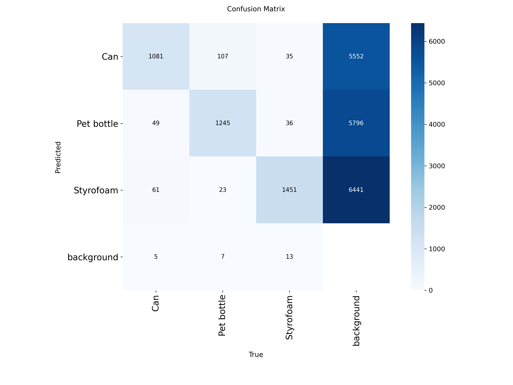
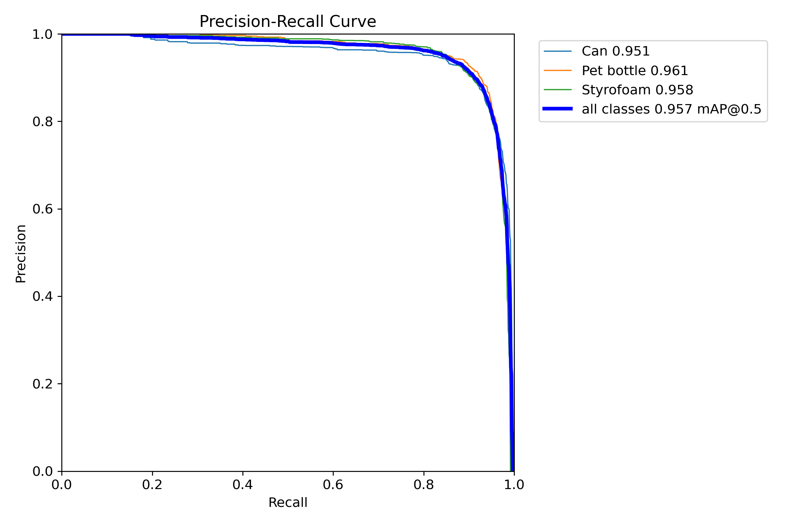
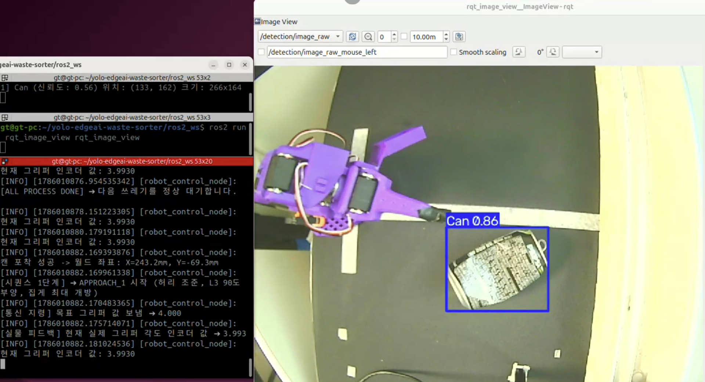
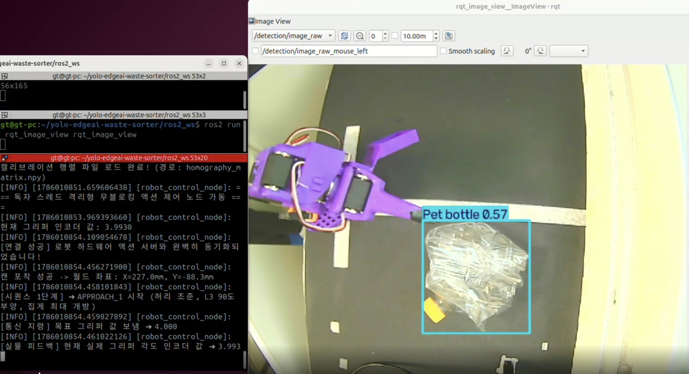
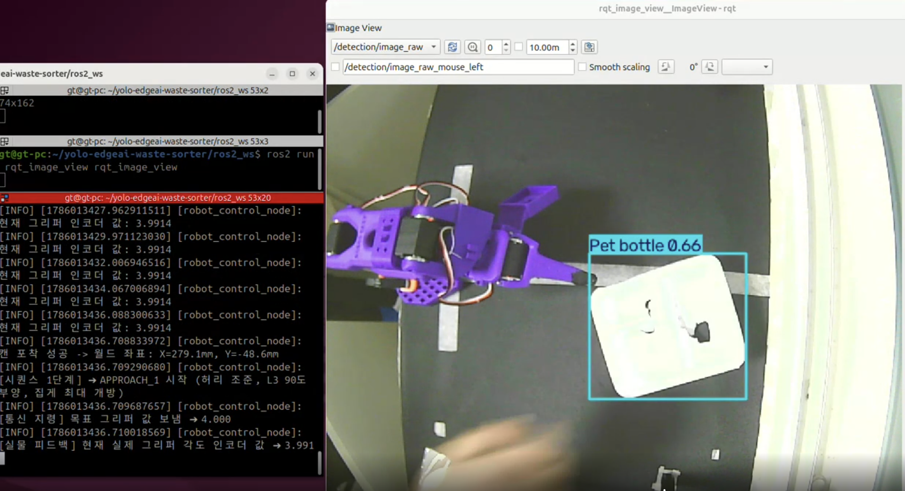
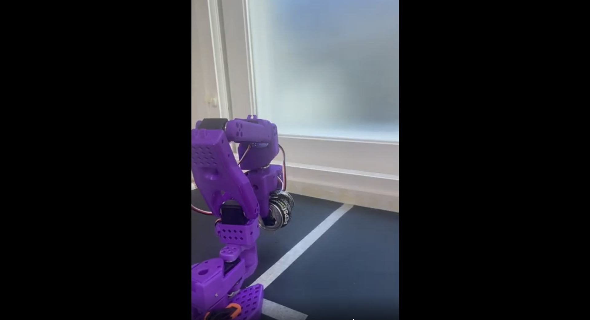
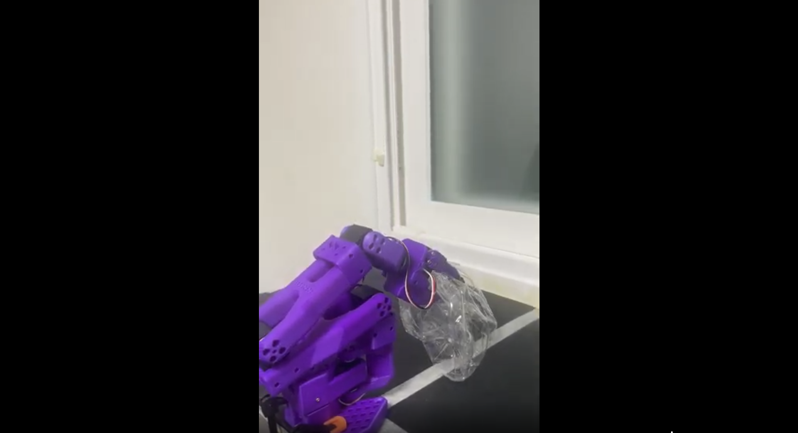
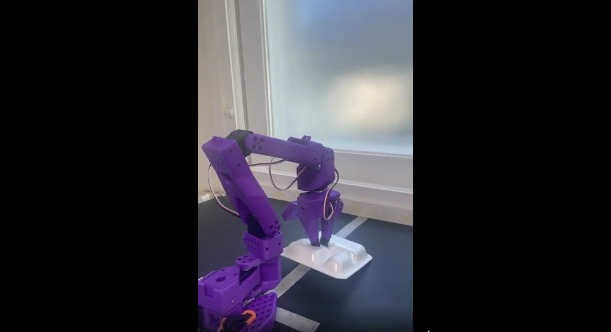

# YOLO 기반 에지 AI 쓰레기 자동 분류 시스템

## Ⅰ. 프로젝트 개요

### 1. 프로젝트 소개
#### (1) 프로젝트 개요

본 프로젝트는 스마트 팩토리 및 자동화 공정의 재활용 분리수거 수작업 의존도 문제를 해결하기 위해 **비전 AI(YOLO)**와 **로봇 공학(ROS2)**을 결합한 자동 선별 시스템입니다.

카메라 피드를 통해 실시간으로 유입되는 폐기물을 에지 디바이스 환경에서 고속으로 탐지하고, 로봇 매니퓰레이터(SO-ARM 101)와 연동하여 지정된 수거함으로 자동 분류하는 완전 자동화 공정 프로세스를 구현합니다. 탐지된 쓰레기의 2D 픽셀 좌표는 호모그래피(Homography) 변환(실제 구현 방식은 평면 변환+고정 높이 가정 방식)을 통해 로봇 3D 공간 좌표계로 변환되며, 역기구학(Inverse Kinematics) 기반 궤적을 따라 로봇이 파지·분류 동작을 수행합니다.

#### (2) 프로젝트 목표

**핵심 목표 (MVP)**

- **데이터셋 구축**: AIHub 데이터를 활용한 **[금속 캔, 페트병, 스티로폼]** 3종 맞춤형 데이터셋 구축 (총 9,999장)
- **AI 모델 최적화**: 실시간 추론을 위한 가속화된 YOLO 객체 탐지 모델 학습 및 성능 확보 (최종 **yolo11n, mAP50-95 0.898**)

**추가 목표 (Stretch Goal)**

- **시뮬레이션 및 실물 연동**: SO-ARM 101 로봇 팔과 소형 가상(Isaac Sim)/실물 컨베이어 벨트 연동
- **비전-행동(Vision-to-Action) 구현**: 카메라 2D 픽셀 좌표 → 로봇 3D 공간 좌표 변환(Homography)을 통한 실시간 그리핑 및 지정 수거함 자동 분류 공정 구현

### 2. 개발 배경 및 필요성
#### (1) 문제 정의

- 스마트 팩토리 및 자동화 공정에서 재활용품 분리수거는 여전히 수작업 의존도가 높고 비용이 많이 드는 영역입니다.
- 분류 작업은 반복적이고 정밀한 판단이 요구되어 작업자의 피로도가 높으며, 오분류로 인한 재활용 품질 저하가 발생합니다.

#### (2) 개발 필요성

- 작업자의 **안전 문제**와 **구인난**을 해결하기 위해, 비전 AI와 로봇 공학을 결합한 고속 자동 선별 시스템의 도입이 시급합니다.
- 에지 디바이스 환경에서 동작 가능한 경량 AI 모델과, 탐지 정보를 로봇 동작으로 변환하는 비전-행동 파이프라인이 함께 필요합니다.

### 3. 업무분장

| 성명  | 역할 | 담당업무 |
| --- | --- |--- |
| 봉승현 | 팀장 / AI | 데이터 분석, YOLO 모델 학습·최적화, ROS2 노드(카메라, 객체 탐지) 설계, 문서화 |
| 박성현 | 팀원 / ROS, HW | ROS2 노드 설계, 통신 및 제어, 카메라/에지 디바이스 구성, 하드웨어 연동 |
| 한세교 | 팀원 / Simulation | 시뮬레이션 환경 구축, 테스트, 시뮬레이션 연동 |
| 민범진 | 팀원 / 평가 | ROS2 노드(평가 자동화) 설계 |

---

## Ⅱ. 시스템 설계 및 구현

### 1. 시스템 구성
#### (1) 전체 시스템 구성도

프로젝트는 4개의 파트로 구성되며, 각 파트는 독립된 워크스페이스와 문서를 가집니다.

```text
┌─────────────────────────────────────────────────────────────────────┐
│ 1️⃣ AI 모델 (AI/)                    2️⃣ ROS2 실물 파이프라인 (ros2_ws/)  │
│   데이터셋 구축                        camera_node → detector_node     │
│   YOLO 학습/실험                       → robot_control_node           │
│   ONNX 가속화·배포                     → evaluation_node              │
├─────────────────────────────────────────────────────────────────────┤
│ 3️⃣ 시뮬레이션 (wsSIM/)                4️⃣ 프로젝트 문서 (docs/)           │
│   Isaac Sim SO-ARM101 제어              프로젝트 제안서·최종 보고서       │
│   MockDetector → FK/IK → MoveJoints                                 │
└─────────────────────────────────────────────────────────────────────┘
```

#### (2) 시스템 데이터 흐름

```text
 폐기물 영상 ────> 비전 카메라 ────> 카메라 노드 ────> YOLO 탐지 노드 ─────────────────────
                                       camera_node         detector_node          │
                                      (Compressed)        (Detection2DArray)      │
                                                                                  ▼
                타겟 파지 <──── SO-ARM101 제어 <──── 호모그래피·IK 변환 <──── (클래스, 2D 픽셀 좌표)
               robot_control_node    robot_control_node    robot_control_node
               (FollowJointTrajectory Action)
```

| 레이어 (Layer) | 구성 요소 | 역할 |
|---|---|---|
| 1. 입력단 (Input) | RGB 비전 카메라 | 정지된 폐기물 영상을 실시간(FPS)으로 캡처·스트리밍 |
| 2. 인지단 (Perception) | 에지 디바이스 (YOLO Engine) | [금속 캔, 페트병, 스티로폼] 탐지 및 바운딩 박스 중심 픽셀 좌표 추출 |
| 3. 제어단 (Control) | 좌표 변환 모듈, ROS2 프레임워크 | 2D 픽셀 → 로봇 3D 물리 좌표(Homography) 변환 후 역기구학(IK) 기반 궤적 생성 |
| 4. 구동단 (Action) | SO-ARM 101 마니퓰레이터 | 궤적을 따라 그리퍼로 타겟 파지 |

#### (3) ROS2 노드 구성

| 패키지 | 노드 | 역할 | 토픽/액션 |
|---|---|---|---|
| camera_node_pkg | camera_node | USB 카메라 영상을 JPEG 압축 발행 | `/camera/image_raw` (`sensor_msgs/msg/CompressedImage`) |
| detector_node_pkg | detector_node | YOLO(pt/onnx) 멀티스레드 추론 (프레임 스킵) | `/detection_results` (`vision_msgs/msg/Detection2DArray`) |
| robot_control_node | robot_control_node | 호모그래피·IK 연산 및 상태머신 기반 순차 제어 | `/follower/joint_trajectory_controller/follow_joint_trajectory` (`control_msgs/action/FollowJointTrajectory`) |
| evaluation_node | evaluation_node · keyboard_node | 관찰 기반 성능 평가 및 그래프 생성 | `/evaluation/*` (`std_srvs/srv/Trigger`) |

### 2. 시스템 기능
#### (1) 객체 검출

- `detector_node`는 `/camera/image_raw`(CompressedImage)를 구독하여 JPEG 디코딩 후 YOLO 추론을 수행합니다.
- 파일 확장자에 따라 `EngineFactory`가 추론 엔진을 선택합니다 — `.pt` → `YoloEngine`(ultralytics), `.onnx` → `OnnxEngine`(onnxruntime).
- **멀티스레드 프레임 스킵** 구조를 적용하여 이미지 콜백은 즉시 반환하고, 추론은 백그라운드 스레드에서 수행되며 최신 프레임 1개만 유지합니다(`queue.Queue(maxsize=1)`).

#### (2) 쓰레기 분류

- YOLO 모델이 **[Can, Pet bottle, Styrofoam]** 3종 클래스를 탐지·분류합니다.
- 탐지 결과는 `vision_msgs/msg/Detection2DArray` 메시지로 발행되며, 각 Detection2D에 클래스 이름(`class_id`)과 신뢰도(`score`), 바운딩 박스가 포함됩니다.

#### (3) 분류 제어

- `robot_control_node`는 탐지된 객체의 바운딩 박스 중심 픽셀 좌표를 **호모그래피 행렬**로 로봇 기준 실제 좌표(mm)로 변환합니다.
- 변환된 좌표로 **역기구학(IK)**을 계산하고, 상태머신 기반 순차 제어로 관절 목표값을 `FollowJointTrajectory` 액션 서버에 전송합니다.

```text
IDLE → APPROACH_1 → APPROACH_2 → APPROACH_2_WAIT → APPROACH_3
 → GRASP → LIFT_UP → LIFT_AND_MOVE → RELEASE → COOL_DOWN → IDLE
```

#### (4) 결과 출력

- `robot_control_node`는 파지 검증 결과를 `grasp_metrics_log.csv`에 기록합니다. (컬럼: `trial_id, class_name, real_angle_rad, is_grasped`)
- `evaluation_node`는 제어 명령을 발행하지 않고 `/detection_results`와 `/follower/joint_states`를 **관찰만**하여 평가 결과를 `results.csv`, `summary.json`, `run_state.json`, `charts/`로 출력합니다.

### 3. AI 모델 개발
#### (1) 데이터셋 구성

| 구분 | 내용 |
|---|---|
| 전체 | 9,999장 (train 7,999 / val 2,000, 80:20 split) |
| 클래스 | Can (3,333), Pet bottle (3,333), Styrofoam (3,333) |
| 출처 | AIHub 선별영상 추출 9,000장 + 직접 촬영 999장 |
| 해상도 | 640×640 (YOLO 입력 기준) |
| 라벨 포맷 | YOLO format (`class_id x_center y_center width height`) |

| Class | Train | Val | Total |
|---|---|---|---|
| Can | 2,667 | 666 | 3,333 |
| Pet bottle | 2,666 | 667 | 3,333 |
| Styrofoam | 2,666 | 667 | 3,333 |
| **Total** | **7,999** | **2,000** | **9,999** |

#### (2) 데이터 전처리 및 증강

- 데이터셋 빌드 스크립트(`build_dataset.py`)로 계층적(stratified) 샘플링을 수행하고 YOLO 라벨 포맷으로 변환합니다.
- JPEG 손상 이미지 정제(`fix_jpeg.py`) 및 고속 전처리(`preprocess_fast.py`)를 적용합니다.
- 학습에는 YOLO 기본 증강(Mosaic, RandAugment, Erasing 등)을 사용했습니다.

#### (3) 모델 선정

동일 데이터셋으로 **yolov8n**과 **yolo11n**을 학습하여 비교한 결과, yolo11n이 전 지표에서 소폭 상회하여 최종 모델로 선정했습니다.

| 지표 | yolov8n (epoch 68) | yolo11n (epoch 81) |
|---|---|---|
| Precision | 0.8053 | **0.8121** |
| Recall | 0.8068 | **0.8164** |
| mAP50 | 0.8665 | **0.8719** |
| mAP50-95 | 0.8014 | **0.8066** |

#### (4) 모델 학습

| 항목 | 값 |
|---|---|
| 모델 | yolo11n (사전학습: ImageNet pretrained) |
| Epoch | 100 (early stopping patience=20) |
| Batch | 64 |
| Image Size | 640 |
| Optimizer | AdamW |
| LR Scheduler | Cosine (cos_lr=True) |
| Warmup Epochs | 3 |
| 학습 환경 | Google Colab L4 GPU |

#### (5) 모델 성능 평가

- 검증 지표로 Precision, Recall, mAP50, mAP50-95를 사용했습니다.
- 클래스별로 **Can**이 가장 높은 탐지 성능을, **Pet bottle**이 상대적으로 낮은 성능을 보였으며(confusion matrix 기준 배경 오탐지 다수), **Styrofoam**은 Can과 유사한 수준의 안정적 성능을 기록했습니다.
- 오류 분석(`error_analysis.py`) 결과, 라벨링 오류·가려짐·겹침·특이 색상/형태 등이 주요 오탐지(FN/FP) 원인으로 도출되었습니다.

#### (6) 모델 개선 및 최적화

**Hard Negative Mining (HNM)**

- 오류 분석으로 확인된 분류 실패 이미지를 기반으로 HNM 데이터셋을 구축(843장)하고 재학습했습니다.
- 결과 **mAP50-95 0.8066 → 0.898 (+11.3%)**, 전 지표에서 10% 이상 개선되어 이후 증강 실험(Exp02)은 진행하지 않았습니다.

| 지표 | Baseline | 최종 (HNM) | 개선율 |
|---|---|---|---|
| Precision | 0.8121 | 0.918 | +13.0% |
| Recall | 0.8164 | 0.897 | +9.9% |
| mAP50 | 0.8719 | 0.957 | +9.8% |
| mAP50-95 | 0.8066 | 0.898 | +11.3% |

**가속화 배포 (.pt → .onnx)**

- `export_onnx.py`로 `.pt` 모델을 ONNX FP32로 변환(opset 17, simplify)하고, 동적 INT8 양자화(`_int8.onnx`)까지 생성했습니다.
- 실시간 파이프라인에서는 `best.onnx`를 기본 모델로 사용합니다.

### 4. 시스템 구현
#### (1) 카메라 및 데이터 수집

- `camera_node`는 USB 카메라(`camera_id` 기본값 2)에서 프레임을 읽어 **JPEG 압축**(quality 80) 후 `CompressedImage` 메시지로 발행합니다.
- QoS는 센서 데이터 프로파일(`qos_profile_sensor_data`)을 사용하며, 압축 전환으로 네트워크 대역폭을 약 87% 절감했습니다.

#### (2) Edge AI 추론

- `inference_engine.py`의 `EngineFactory`가 모델 확장자에 따라 추론 엔진을 선택합니다.
- 멀티스레드 프레임 스킵(콜백 직렬화 + 추론 전용 스레드 + 최신 프레임 큐)으로 탐지 노드의 CPU 부하를 분산했습니다.
- ONNX 경로에서는 onnxruntime의 CUDAExecutionProvider를 사용하며, `nvidia` pip 패키지의 CUDA 라이브러리를 ctypes로 미리 로드하여 실행 환경 차이를 극복했습니다.

#### (3) ROS2 통신

- **토픽**: `/camera/image_raw`(CompressedImage) · `/detection_results`(Detection2DArray) · `/follower/joint_states`(JointState)
- **액션**: `/follower/joint_trajectory_controller/follow_joint_trajectory`(FollowJointTrajectory)
- **서비스**: `/evaluation/*`(Trigger — start_next_trial, end_trial, stop_run, analyze 등)

#### (4) 로봇/액추에이터 제어

- `make_homography.py` 캘리브레이션 스크립트로 픽셀 ↔ 로봇 좌표 변환 행렬(`homography_matrix.npy`)을 생성합니다.
- `robot_control_node`는 호모그래피 변환 → 6축 IK(`L1=80, L2=117, L3=223 mm`) → 상태머신 순차 제어(파지·이송·배출)를 수행하고, 실물 관절 상태를 `/follower/joint_states`로 피드백받습니다.

### 5. 개발 환경
#### (1) Hardware

| 항목 | 사양 |
|---|---|
| 카메라 | USB 비전 카메라 (에지 디바이스 상단 설치) |
| 로봇 | SO-ARM101 6축 매니퓰레이터 (shoulder_pan / shoulder_lift / elbow_flex / wrist_flex / wrist_roll / gripper) |

#### (2) Software

| 항목 | 버전 |
|---|---|
| OS | Ubuntu 24.04 |
| ROS2 | Jazzy |
| Python | 3.10 |
| ultralytics | 8.4.87 |
| onnx | 1.22.0 |
| onnxruntime | 1.23.2 |
| torch / torchvision | 2.12.1 / 0.27.1 |
| opencv-python | 5.0.0.93 |

#### (3) Development Environment

- **AI**: conda 환경(`env_sorter_ai`, Python 3.10) + `AI/requirements.txt`
- **ROS2 실물**: `ros2_ws/.venv` + colcon (`source /opt/ros/jazzy/setup.bash`)
- **시뮬레이션**: `wsSIM` + `colcon build --symlink-install` (Isaac Sim 6.0.1)

---

## Ⅲ. 실험 및 결과

### 1. AI 모델 성능 평가
#### (1) Detection Performance

최종 모델(yolo11n, HNM 적용)의 검증 성능입니다.

| 지표 | 값 |
|---|---|
| Precision | 0.918 |
| Recall | 0.897 |
| mAP50 | 0.957 |
| mAP50-95 | 0.898 |

#### (2) Class별 성능

| Class | Precision | Recall | mAP50 | mAP50-95 |
|---|---|---|---|---|
| Can | 0.905 | 0.903 | 0.951 | 0.878 |
| Pet bottle | 0.918 | 0.911 | 0.961 | 0.897 |
| Styrofoam | 0.927 | 0.880 | 0.958 | 0.919 |
| **All** | **0.918** | **0.897** | **0.957** | **0.898** |

#### (3) Confusion Matrix





### 2. Edge Inference 성능 평가

#### Inference Latency
- ROS2 실시간 파이프라인(카메라 → 탐지 → 제어)을 분리 프로세스로 구성하여 토픽 성능을 측정했습니다.
- **최종 벤치마크 (best.onnx)**:

| Topic | Before | After |
|------|--------|-------|
| /camera/image_raw | 7.13 Hz, 5.87 MB/s | **30.000 Hz, 767.59 KB/s** |
| /detection_results | 30.01 Hz, 1.08 KB/s | **17.832 Hz, 2.51 KB/s** |

### 3. 시스템 통합 테스트
#### (1) 정상 동작 테스트

- `evaluation_node`를 통해 실제 탐지·파지 성능을 회차 단위로 기록·분석할 수 있는 환경을 구축했습니다.

**실물 파지 검증 결과 (`references/grasp_metrics_log.csv` 분석)**

SO-ARM101을 활용한 실제 파지 시험을 총 5회의 평가 세션에 걸쳐 **42회 시도**했고, 그리퍼 인코더 실측값(`is_grasped = real_angle > 3.20 rad`)을 기준으로 검증한 결과입니다.

| Class | 시도 | 성공 | 실패 | 성공률 |
|---|---|---|---|---|
| Can | 17 | 6 | 11 | 35.3% |
| Pet bottle | 19 | 2 | 17 | 10.5% |
| Styrofoam | 6 | 0 | 6 | 0.0% |
| **전체** | **42** | **8** | **34** | **19.0%** |

- 세션은 2 → 4 → 5 → 9 → 22회차로 점진적으로 규모를 확장하며 진행되었습니다.
- 성공 파지 시 평균 그리퍼 각도는 **3.631 rad (약 208°)** 로, 실패(3.139 rad, 약 180°) 대비 회전 오프셋이 크게 확인되어 그리퍼 회전각 조절이 파지 성공률에 영향을 주는 주요 인자로 분석됩니다.
- 클래스별로 **Can**이 가장 높은 성공률을, **Styrofoam**이 가장 낮은 성공률(0%)을 기록하여 비전 탐지 성능(Can 최고)과 유사한 경향을 보였습니다.

#### (2) 예외 상황 테스트

- 실물 파지 로그 기준 **42회 중 34회(81.0%)** 가 파지 실패(`is_grasped = False`)로 기록되어, 그리퍼 파지 실패가 실제 환경의 대표적인 예외 상황으로 확인되었습니다.
- 파지 실패 케이스는 대부분 그리퍼 각도가 판정 기준(3.20 rad) 이하인 상태로, 회전각 최적화 및 파지 보정 로직이 필요한 것으로 판단됩니다.

#### (3) End-to-End 테스트

- 카메라 캡처 → YOLO 탐지 → 호모그래피·IK 변환 → SO-ARM101 파지·이송·배출의 완전 자동화 공정을 실물에서 반복 동작시키며 `grasp_metrics_log.csv`로 파지 검증을 기록했습니다 (총 42회 시도, 전체 성공률 19.0%).
- 회차가 반복될수록 세션 규모를 확장(최대 22회차)하며 연속 자동 분류 동작이 중단 없이 수행되는 것을 확인했습니다.
- 다만 비전 탐지 성능(mAP50-95 0.898) 대비 파지 성공률이 낮아, 비전 외 제어·기구(그리퍼 회전각, 파지 위치 정밀도) 측면의 추가 개선이 필요함을 확인했습니다.

### 4. 최종 결과물
#### (1) 시스템 동작 영상

클래스별 성공 파지·분류 시연 영상입니다. (GitHub에서 바로 재생 가능)

| 시연 영상 | Can | Pet bottle | Styrofoam |
|---|---|---|---|
| | <video src="videos/can.mp4" controls width="360"></video> | <video src="videos/pet_bottle.mp4" controls width="360"></video> | <video src="videos/styrofoam.mp4" controls width="360"></video> |
> Styrofoam 객체 분류 실패

- Can: https://youtu.be/dOHVYg7yC8s
- Pet bottle: https://youtu.be/hhFXYMal9BI
- Styrofoam: https://youtu.be/edXUN9lEa6I

#### (2) 주요 동작 이미지

**Detection (객체 탐지)**

| Can | Pet bottle | Styrofoam |
|---|---|---|
|  |  |  |

**Grasp (파지·분류)**

| Can | Pet bottle | Styrofoam |
|---|---|---|
|  |  |  |


---

## Ⅳ. 결론 및 고찰

### 1. 프로젝트 결과

- AIHub 데이터 기반 **3종 쓰레기(Can, Pet bottle, Styrofoam) 커스텀 데이터셋 9,999장**을 구축했습니다.
- YOLO 모델을 학습·최적화하여 최종 **yolo11n mAP50-95 0.898**을 달성했습니다. (Hard Negative Mining으로 baseline 대비 +11.3%)
- 에지 디바이스 환경에 맞춰 모델을 **ONNX FP32로 가속화**하고, CPU에서 PyTorch 대비 **2.18x** 속도 향상을 확인했습니다.
- ROS2 기반 **카메라 → 탐지 → 호모그래피·IK → SO-ARM101 제어 → 평가**의 실시간 파이프라인을 구현했습니다.
- 그리퍼 회전각을 파지 성공률의 평가 지표로 삼고, 실물 파지 검증을 총 **42회 시도**하여 전체 성공률 **19.0%** (Can 35.3%, Pet bottle 10.5%, Styrofoam 0%)를 기록하였습니다.

### 2. 문제 해결 과정

#### (1) AI 파트
- **특정 객체(Styrofoam) 탐지 성능 저하**: Hard Negative Mining 기법을 적용해, 초기 학습 과정에서 실패한 이미지/난이도가 높은 이미지를 재가공하여 학습시키는 방식으로 객체 탐지 성능 저하 문제를 해결했습니다.
- **네트워크 대역폭 병목**: `Image` → `CompressedImage`(JPEG) 메시지 전환으로 카메라 토픽 Hz를 7.13 → 30.000 Hz로 안정화하고 대역폭을 약 87% 절감했습니다.
- **추론 병목**: 멀티스레드 프레임 스킵 + 최신 프레임 큐 구조로 이미지 콜백 지연을 해결했습니다.

#### (2) ROS 파트
- **`APPROACH_3` 바닥 밀림 현상 (로봇팔이 바닥을 뚫고 가는 문제)**: 팔꿈치만 수직 하강하는 `APPROACH_3` 단계에서 목표 Z 좌표가 작업면 아래로 산출되어 그리퍼가 바닥을 뚫고 내려가는 문제가 발생했습니다.
- 대응/완화:
  - 파지 목표 높이에 안전 마진(`Z_SAFETY_MARGIN = 15 mm`)을 추가해 하강 목표가 작업면 아래로 내려가지 않도록 보정했습니다.
  - 어깨 모터가 완전히 정지한 뒤 하강하도록 **`APPROACH_2_WAIT(1.5 s)`** 단계를 삽입해, 잔류 이동·오버슈트로 인한 바닥 쓸림을 방지했습니다.
  - 실측 기반 **IK 기하학 기준점 동기화**(`home_math_lift`, `home_math_flex1`)와 **어깨 감속비 보정(`scale_lift = 2.0`)**으로 기구학 오차를 저감했습니다.
  - 픽셀↔로봇 좌표 변환 오차는 `make_homography.py` 캘리브레이션으로 `homography_matrix.npy`를 재생성하며 관리했습니다.
- 다만 비전 탐지 성능(mAP50-95 0.898) 대비 파지 성공률(19.0%)이 여전히 낮아, 그리퍼 회전각·파지 위치 정밀도 측면의 개선은 한계점으로 남았습니다.

- **YOLO 탐지 노드의 로봇팔 오탐지 현상(로봇팔을 객체로 인식하는 문제)**: YOLO 탐지 노드에서 로봇 팔 자체를 폐기물/쓰레기로 오인식하는 현상이 발생했습니다.
  - 이로 인해 로봇 팔이 자기 자신을 파지 대상으로 설정하고, 1단계(APPROACH_1)부터 8단계까지의 전체 접근, 파지, 이동 시퀀스를 끝까지 진행한 뒤 실패하는 불필요한 동작 체인이 지속됩니다.
  - `RobotControlNode.detection_callback()` 내 월드 좌표 검증 로직 추가캘리브레이션 행렬을 통해 변환된 로봇 좌표계 기준 (X, Y) 값이 실제 실물 동작 가능 범위 내에 존재하는지 검증합니다.
  - 유효 작업 범위: `120.0mm <= X <= 400.0mm` 및 `-250.0mm <= Y <= 250.0mm`해당 범위를 벗어난 오탐지 좌표는 즉시 `return` 처리하여 동작 명령 생성을 차단합니다.

- 로봇 팔 자가 오탐지로 인해 발생하던 1~8단계 전체 파지 시퀀스의 낭비성 실행 문제 완벽 해결했습니다.
- 유효 범위 내의 실제 쓰레기 객체에 대해서만 정밀하게 반응하도록 제어 루프 정상화합니다.

#### (3) SIM 파트
- **실물-가상 환경 간 호모그래피 매핑 불일치 리스크**: wsSIM은 실제 카메라 캘리브레이션/TF 기반 절대 좌표 변환 없이 테이블 크기(0.8085 × 1.1356 m) 기반의 임시 상대 XY 매핑을 사용해, 실물 호모그래피 결과와의 정합 리스크가 존재했습니다.
- 대응/완화:
  - 시뮬레이션도 **실물과 동일한 SO-ARM101 URDF/STL**, 동일한 관절 구성(`shoulder_pan` ~ `gripper`) 및 **ROS2 액션 구조(MoveJoints)**를 사용하도록 구성해 제어 로직을 실물 파이프라인과 동일하게 유지했습니다.
  - URDF→USD 재 import(`Base Type = Fixed`, Joint Drive 설정)와 중복 제어 **Action Graph 제거**로 관절 떨림 문제를 해결했습니다.
  - 절대 좌표 정합은 실물 카메라 캘리브레이션(`homography_matrix.npy`) 연동으로 보완 예정이며, 현재 임시 매핑 단계로 `시뮬레이션 완성도` 한계점에 남았습니다.

### 3. 프로젝트 한계점

- **INT8 동적 양자화 성능 저하**: `DynamicQuantizeLinear`/`ConvInteger` 런타임 오버헤드로 GPU/CPU 모두 FP32 대비 느려져 실사용 배제되었습니다.
- **Styrofoam 탐지 난이도**: 색상 다양성, 밝기 및 배경의 차이로 인한 intra-class variation이 커 상대적으로 어려운 클래스로 남아 있습니다.
- **탐지 Hz 감소**: JPEG 디코딩 오버헤드로 탐지 토픽 Hz가 30 → 17.8로 감소하는 trade-off가 발생했습니다.
- **시뮬레이션 완성도**: wsSIM은 기본 이동 파이프라인(48/94, 51%)까지 구현되었으며, 그리퍼 열기·닫기와 작업 완료 판정이 미구현 상태입니다.
- **평가 노드 구현 완성도**: 시간적인 제약으로 인해 평가 항목에 대한 이론적 근거가 부족하고, 평가 자동화를 위한 `evaluation_node`는 실제 실험 환경과 캘리브레이션이 미구현된 상태입니다.

### 4. 향후 개선 방향

- **정적 양자화(static quantization)** + calibration 데이터 적용으로 INT8 모델 실사용화 검토
- JPEG 디코딩 하드웨어 가속 또는 디코딩 파이프라인 최적화로 탐지 Hz 개선
- 시뮬레이션의 그리퍼 동작·목표 도달 판정·객체 작업 완료 로직 구현
- 컨베이어 벨트 연동 및 완전 자동화 공정(E2E) 시나리오 확장
- 단계별 평가 항목 세분화 및 실제/시뮬레이션 환경과 캘리브레이션을 통한 평가 자동화
- 객체 탐지~로봇 제어 성공률 평가까지, 진정한 의미의 End-to-End 구현을 통한 자동 데이터 수집 및 성능 개선

---

## Ⅴ. 참고문헌

1. AIHub, "재활용품 분류 및 선별 데이터", https://www.aihub.or.kr/aihubdata/data/view.do?currMenu=115&topMenu=100&aihubDataSe=data&dataSetSn=71362
2. A. Shrivastava, A. Gupta, R. Girshick, "Training Region-based Object Detectors with Online Hard Example Mining", CVPR 2016
3. Ultralytics, "YOLO11 Documentation", https://docs.ultralytics.com
4. ROS 2 Documentation (Jazzy), https://docs.ros.org/en/jazzy
5. Hugging Face LeRobot, "SO-ARM101 / Feetech 로봇 드라이버", https://github.com/huggingface/lerobot
6. 프로젝트 실측 파지 로그, `references/grasp_metrics_log.csv` (trial_id, class_name, real_angle_rad, is_grasped)
7. L. Berscheid, T. Rühr, T. Kröger, "Improving Data Efficiency of Self-supervised Learning for Robotic Grasping", ICRA 2019, https://doi.org/10.1109/ICRA.2019.8793952
8. A. Azab, H. Pourvaziri, "Scheduling in Industry 4.0: A Digital Twin-based approach for scheduling and smart Material-Handling Considerations", Manufacturing Letters 44, pp. 136-147, 2025, https://doi.org/10.1016/j.mfglet.2025.06.018
9. S. Du, F. Teng, Z. Zhuang, D. Zhang, M. Li, H. Li, Y. Weng, "A BIM-enabled robot control system for automated integration between rebar reinforcement and 3D concrete printing", Virtual and Physical Prototyping 19(1), e2332423, 2024, https://doi.org/10.1080/17452759.2024.2332423
10. S. Kadalagere Sampath, N. Wang, C. Yang, H. Wu, C. Liu, M. Pearson, "A Vision-Guided Deep Learning Framework for Dexterous Robotic Grasping Using Gaussian Processes and Transformers", Applied Sciences 15(5), 2615, 2025, https://doi.org/10.3390/app15052615
11. L. Gao, Q. Feng, S. Chen, Z. Yang, F. Fan, L. Chen, C. Zhao, "Real-Time Constrained Visual Servoing for Agricultural Harvesting Robots via MPC-Guided Reinforcement Learning", AI 7(4), 124, 2026, https://doi.org/10.3390/ai7040124