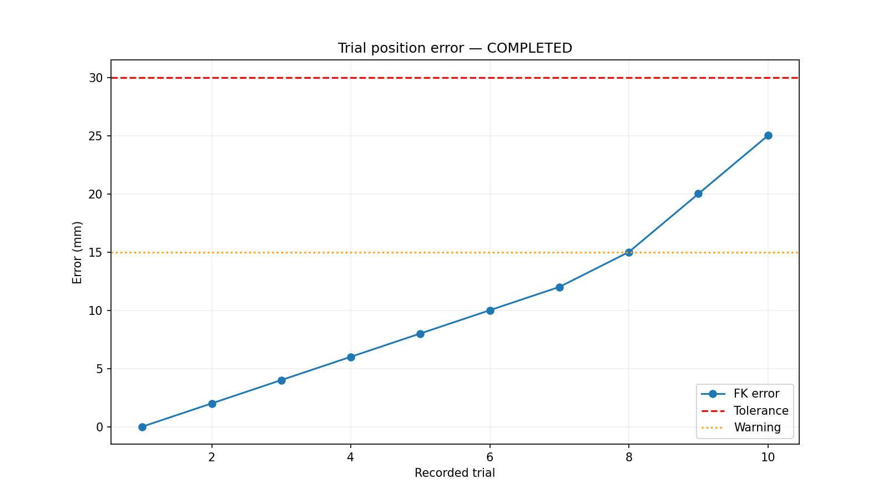

# SO-ARM 101 평가 노드

YOLO 탐지 결과와 SO-ARM의 실제 관절 상태를 **관찰만** 하여 성능을 기록하는
ROS 2 패키지입니다. 로봇 이동 명령, trajectory, Action Goal 또는 Cancel을
발행하지 않습니다.

## 무엇을 측정하나요?

- YOLO 탐지 성공률과 클래스 정확도
- 실제 관절각을 FK로 변환한 그리퍼 위치
- 정답 GT XY와 FK XY 사이의 위치 오차 및 허용오차 통과율
- 반복 평가의 오차 분산과 실패 원인
- 클래스별 성능 및 PNG 요약 그래프

## 코드 구조

ROS 2 튜토리얼처럼 노드 파일 하나에 모든 기능을 넣을 수도 있지만, 이
패키지는 평가 상태, 키보드 입력, 그래프 생성을 따로 테스트할 수 있도록
역할별로 파일을 나눴습니다.

```text
evaluation_node/
├── evaluation_node.py   # ROS 2 구독/서비스/timer를 연결하는 실제 평가 노드
├── keyboard_node.py     # s/e/q 키 입력을 평가 서비스 호출로 바꾸는 노드
├── core.py              # ROS 없이 테스트 가능한 평가 회차 상태와 CSV/JSON 저장
├── config_loader.py     # 두 노드가 공유하는 evaluation.yaml 탐색/로딩
├── kinematics.py        # JointState를 평가용 FK XYZ 좌표로 변환
├── visualization.py     # 평가 종료 후 PNG 그래프 생성
└── keyboard_control.py  # 터미널 키 입력 처리와 TTY 복구
```

가장 중요한 흐름은 다음과 같습니다.

```text
evaluation_node.py  ── ROS 메시지/서비스 수신
        │
        ▼
core.py             ── 회차 시작/종료, 실패 사유, 결과 파일 저장
```

따라서 `core.py`는 별도 ROS 노드가 아니라, `evaluation_node.py`가 사용하는
순수 Python 평가 로직입니다. 이 분리 덕분에 `rclpy`를 실행하지 않고도
단위 테스트에서 회차 상태와 결과 저장을 검증할 수 있습니다.

## 설계 의도

이 패키지의 핵심 아이디어는 **로봇을 제어하지 않고 관찰만 해서 평가한다**는
것입니다. 이미 동작 중인 detector와 SO-ARM 제어 노드가 있고, 평가 노드는 그
옆에서 결과만 기록합니다.

- 평가 노드는 로봇 이동 명령을 보내지 않습니다.
- detector 결과는 클래스 성공 여부 판단에만 사용합니다.
- 위치 평가는 카메라 픽셀이 아니라 실제 관절값에서 계산한 FK 좌표로 합니다.
- 회차 시작과 저장 시점은 작업자가 키보드로 정합니다.
- 결과 파일은 매 실행마다 새 폴더에 저장해 이전 평가를 덮어쓰지 않습니다.

이렇게 만든 이유는 평가 코드가 로봇 동작에 영향을 주지 않게 하고, 실패 원인을
탐지·위치·작업자 종료 시점으로 나누어 기록하기 위해서입니다.

## 동작 흐름

평가는 자동으로 정해진 횟수만큼 돌지 않습니다. 작업자가 `s`와 `e`를 누른
횟수가 곧 실제 평가 회차 수입니다.

```text
1. evaluation_node 실행
   └─ 설정 파일을 찾고 값이 유효한지 검사한다.

2. keyboard_node 실행
   └─ s/e/q 키를 평가 서비스 호출로 바꾼다.

3. s 입력
   └─ 새 회차를 시작하고 현재 목표 클래스/위치를 안내한다.

4. 탐지 결과 / 관절 상태 / 액션 피드백 관찰
   ├─ 탐지 결과가 들어오면 최고 점수 클래스를 기록한다.
   └─ gripper가 닫히는 순간의 관절값으로 FK 위치를 기록한다.

5. e 입력
   └─ 현재 회차를 results.csv 한 행으로 저장한다.

6. q 입력
   └─ 활성 회차가 있으면 폐기하고, 저장된 회차만 summary와 그래프로 분석한다.
```

`watchdog`는 시간이 지났다고 회차를 자동 저장하지 않습니다. 대신
`detection_timeout`, `operation_timeout` 같은 실패 사유만 활성 회차에
추가하고, 실제 CSV 저장은 작업자가 `e`를 눌렀을 때 수행합니다.

## 데이터가 기록되는 방식

한 회차는 다음 정보를 모아 `results.csv`의 한 행이 됩니다.

| 항목 | 기록 방식 |
|---|---|
| 목표 클래스/위치 | 설정 파일의 `target_classes`와 `positions`를 순환하며 안내 |
| 탐지 결과 | `/detection_results`의 모든 후보 결과 중 점수가 가장 높은 클래스 |
| 그립 위치 | `/follower/joint_states` 또는 액션 피드백에서 얻은 6축 관절값을 FK로 변환 |
| 위치 오차 | 설정된 GT XY와 FK XY 사이의 거리 |
| 실패 사유 | 탐지 시간 초과, 클래스 불일치, 위치 허용오차 초과, 수동 종료 시점 문제 등 |

`summary.json`은 저장된 CSV 행을 다시 요약한 파일이고, `run_state.json`은 실행
중 상태와 키보드 노드 발견 여부, 그래프 생성 상태를 확인하기 위한 파일입니다.

## 1. 설정

`config/evaluation.yaml`을 열고 한글 주석에 따라 다음 값만 실제 측정값으로
입력합니다.

1. `positions`: 위치 ID별 실제 GT X/Y 좌표(mm)
2. `position_tolerance_mm`: 위치 합격 기준
3. `position_warning_mm`: 그래프에만 표시하는 경고선
4. 실제 장비에서 확인한 그리퍼 임계값

값을 모두 확인한 후 아래 두 항목을 `true`로 바꿉니다.

```yaml
configuration_confirmed: true
thresholds_locked: true
```

평가 횟수는 설정하지 않습니다. 실제 `s` 입력 수만큼 회차가 생성됩니다.

## 2. 설치 및 빌드

```bash
cd ros2_ws
rosdep install --from-paths src --ignore-src -r -y
colcon build --packages-select evaluation_node
source install/setup.bash
```

Ubuntu 그래프 글꼴과 Matplotlib가 없다면 설치합니다.

```bash
sudo apt install python3-matplotlib fonts-nanum
```

## 3. 실행

먼저 detector, SO-ARM bringup 및 robot control 노드를 실행합니다. 그 다음 두
터미널에서 평가 노드를 실행합니다. 설정 경로 인자는 필요 없습니다.

### 터미널 1: 센서 관찰 및 결과 저장

```bash
source install/setup.bash
ros2 run evaluation_node evaluation_node
```

### 터미널 2: 키보드 입력

```bash
source install/setup.bash
ros2 run evaluation_node keyboard_node
```

## 4. 키 사용법

| 키 | 동작 |
|---|---|
| `s` | 새 회차를 시작합니다. 중복 `s`는 거부됩니다. |
| `e` | 현재 회차를 CSV 한 행으로 저장합니다. |
| `q` | 활성 회차를 폐기하고 저장된 회차를 분석한 뒤 종료합니다. |
| `Ctrl+C` | `q`와 같은 종료 절차를 수행합니다. |

`s`를 누른 뒤 객체를 배치해도 됩니다. 기본 탐지 대기시간은 30초이므로 그
안에 배치해야 합니다. 가장 안정적인 방법은 안내된 객체와 위치를 준비한 뒤
`s`를 누르고 즉시 배치하는 것입니다.

정상 운용 순서는 다음과 같습니다.

```text
NEXT 안내 확인 → s → 객체 배치 → YOLO/로봇 작업 확인 → e → 다음 회차
```

## 5. 시작되지 않을 때

다음 명령으로 원인을 확인합니다.

```bash
ros2 service call /evaluation/preflight std_srvs/srv/Trigger "{}"
```

주요 차단 사유는 다음과 같습니다.

| 사유 | 확인할 내용 |
|---|---|
| `configuration_not_confirmed` | YAML의 `configuration_confirmed` |
| `thresholds_not_locked` | final 평가의 `thresholds_locked` |
| `publisher_missing:/detection_results` | detector 노드 실행 여부 |
| `publisher_missing:/follower/joint_states` | SO-ARM 드라이버 실행 여부 |
| `valid_joint_state_missing` | 6개 관절 이름과 유효한 position 값 |
| `gripper_not_open` | 그리퍼 측정값과 open 임계값 |

## 6. 결과 파일

기본 출력 경로는 `/tmp/so_arm101_evaluation`입니다. 매 실행마다 UTC 시간이
포함된 새 폴더를 만들어 이전 결과를 보존합니다.

```text
/tmp/so_arm101_evaluation/
└── evaluation_YYYYMMDDTHHMMSS_ffffffZ/
    ├── results.csv
    ├── summary.json
    ├── run_state.json
    └── charts/
        ├── overall_summary.png
        ├── class_performance.png
        ├── trial_position_error.png
        ├── target_vs_fk.png
        ├── failure_reasons.png
        └── visualization_manifest.json
```

`q`로 폐기된 활성 회차는 CSV와 통계에 포함되지 않습니다.

## 7. ROS 인터페이스와 독립성

### 구독

- `/detection_results` (`vision_msgs/msg/Detection2DArray`)
- `/follower/joint_states` (`sensor_msgs/msg/JointState`)
- FollowJointTrajectory Action status 및 feedback 토픽

### 서비스

- `/evaluation/start_next_trial`
- `/evaluation/end_trial`
- `/evaluation/abort_trial`
- `/evaluation/stop_run`
- `/evaluation/status`
- `/evaluation/preflight`
- `/evaluation/record_grasp`
- `/evaluation/record_sort`
- `/evaluation/analyze`

모든 서비스 형식은 `std_srvs/srv/Trigger`입니다. 평가 패키지에는 로봇 제어
publisher와 FollowJointTrajectory Action client가 없습니다.

---

## 내부 코드 따라 읽기

이 절은 위의 사용법을 읽은 뒤, 실제 구현이 **어떤 순서로 데이터를 넘기는지**
궁금한 입문자를 위한 안내서입니다. 먼저 큰 흐름만 보고, 필요한 세부 설명은
`<details>`를 펼쳐 확인하세요. 인용한 코드는 현재 구현의 핵심 부분만 짧게
가져왔습니다.

| 읽는 목적 | 권장 범위 |
|---|---|
| 처음 실행하는 사용자 | 아래 **전체 코드 지도**만 읽고, 앞 절의 실행·키 사용법으로 돌아가도 충분합니다. |
| 동작 원인을 찾는 사용자 | 궁금한 번호의 접기 영역만 펼쳐 메시지의 입력과 다음 전달 위치를 확인합니다. |
| 소스를 수정하려는 개발자 | 2번부터 차례로 읽은 뒤 마지막 **실제 코드 탐색 순서**에 따라 원본 파일과 대조합니다. |

### 1. 전체 코드 지도

```text
keyboard_control.py
  └─ 키 입력을 Queue에 추가
       ↓
keyboard_node.py
  └─ Queue의 명령을 /evaluation/* 서비스로 호출
       ↓
evaluation_node.py
  ├─ 서비스 요청으로 회차 시작·종료
  ├─ ROS 토픽으로 탐지·관절·액션 상태 관찰
  └─ 관찰 결과를 EvaluationRun에 전달
       ↓
core.py
  ├─ 회차 상태와 합격 여부 계산
  └─ CSV·JSON 저장
       ↓
visualization.py
  └─ CSV를 다시 읽어 PNG 그래프 생성
```

- **무엇을 하는가:** 키 입력부터 결과 그래프까지의 실행 관계를 위에서 아래로 보여 줍니다.
- **왜 필요한가:** 파일 이름만 보고 읽기보다 데이터가 이동하는 방향을 먼저 잡기 위해 필요합니다.
- **언제 실행되는가:** 키보드 노드와 평가 노드를 실행한 뒤, 키와 ROS 메시지가 들어올 때 이 흐름이 이어집니다.
- **다음으로 어디에 전달되는가:** 최종 데이터는 `results.csv`에 저장되고 `visualization.py`가 이를 다시 읽습니다.

옆에서 돕는 두 모듈도 있습니다. `config_loader.py`는 두 ROS 노드가 같은 설정을
찾게 하고, `kinematics.py`는 관절값을 XYZ 좌표로 바꿉니다. 즉 둘은 위 흐름의
새 단계라기보다 여러 단계에서 호출되는 **보조 모듈**입니다.

<details>
<summary><strong>2. evaluation_node.py: ROS와 평가 로직을 잇는 접착제</strong></summary>

`EvaluationNode.__init__`은 먼저 관찰할 토픽을 등록합니다.

```python
self.create_subscription(Detection2DArray, '/detection_results',
                         self._detection, 10)
self.create_subscription(JointState, '/follower/joint_states',
                         self._joints, 10)
```

- **무엇을 하는가:** `create_subscription`은 해당 토픽의 메시지가 도착할 때 지정한 콜백을 실행하도록 등록합니다. `/detection_results`는 `_detection`, 관절 상태는 `_joints`를 호출합니다.
- **왜 필요한가:** 평가 노드가 탐지기와 로봇의 상태를 명령하지 않고 관찰하기 위해 필요합니다. 마지막 `10`은 평가 횟수가 아니라 ROS 2 QoS 큐 깊이입니다.
- **언제 실행되는가:** 등록은 노드 생성 때 한 번 이루어지고, 콜백은 `rclpy.spin(node)`가 실행되는 동안 메시지가 올 때마다 계속 실행됩니다. 한 번 읽고 끝나는 절차가 아닌 이벤트 기반 구조입니다.
- **다음으로 어디에 전달되는가:** 콜백이 정리한 탐지 클래스와 FK 좌표는 `self.run`, 즉 `EvaluationRun`으로 전달됩니다.

서비스도 같은 방식으로 한꺼번에 등록합니다.

```python
for name, callback in (
        ('start_next_trial', self._start_service),
        ('end_trial', self._end_service),
        ('abort_trial', self._abort_service),
        ('stop_run', self._stop_service),
        ('status', self._status_service),
        ('preflight', self._preflight_service),
        ('record_grasp', self._grasp_service),
        ('record_sort', self._sort_service),
        ('analyze', self._analyze_service)):
    self.create_service(Trigger, f'/evaluation/{name}', callback)
```

- **무엇을 하는가:** 반복문 하나가 `/evaluation/start_next_trial`, `/evaluation/end_trial` 등을 모두 `Trigger` 서비스로 등록합니다.
- **왜 필요한가:** 이름마다 거의 같은 등록 코드를 반복하지 않고, 서비스 이름과 콜백의 대응을 한눈에 보여 주기 위해 필요합니다.
- **언제 실행되는가:** 노드 초기화 때 등록되고, 이후 키보드 노드나 사용자가 서비스를 요청할 때 해당 콜백이 실행됩니다.
- **다음으로 어디에 전달되는가:** 서비스 콜백은 복잡한 평가를 직접 하지 않고 `EvaluationRun.start_trial()`, `end_trial()` 같은 메서드로 넘기는 얇은 연결 계층입니다.

</details>

<details>
<summary><strong>3. 탐지 결과에서 최고 점수 클래스를 고르기</strong></summary>

```python
hypotheses = [
    result.hypothesis
    for detection in message.detections
    for result in detection.results
]
if hypotheses:
    best = max(hypotheses, key=lambda hypothesis: hypothesis.score)
    self.run.record_detection(best.class_id)
```

- **무엇을 하는가:** 모든 `detection`의 모든 `result`에서 `hypothesis`를 꺼내고, `score`가 가장 높은 하나를 골라 클래스 ID만 기록합니다.
- **왜 필요한가:** 한 메시지에 여러 박스와 후보 클래스가 올 수 있으므로 평가에 사용할 대표 결과 하나를 정해야 합니다.
- **언제 실행되는가:** 활성 회차 중 `/detection_results` 메시지가 도착할 때마다 `_detection`에서 실행됩니다.
- **다음으로 어디에 전달되는가:** `best.class_id`는 `core.py`의 `record_detection()`으로 전달됩니다.

중첩 리스트 컴프리헨션을 일반 반복문으로 풀어 쓴 **의사 코드**는 다음과 같습니다.

```text
hypotheses = 빈 목록
각 detection에 대해:
    detection의 각 result에 대해:
        hypotheses에 result.hypothesis 추가
score가 가장 큰 hypothesis를 best로 선택
```

- **무엇을 하는가:** 위 Python 코드의 두 겹 반복을 단계별 말로 풀어냅니다.
- **왜 필요한가:** 짧지만 낯선 리스트 컴프리헨션을 처음 보는 독자가 반복 범위를 이해할 수 있게 합니다.
- **언제 실행되는가:** 실제 코드는 아니며 `_detection`의 목록 생성 과정을 읽을 때 참고합니다.
- **다음으로 어디에 전달되는가:** 만들어진 목록은 `max(..., key=...)`의 입력이 됩니다.

예를 들어 후보가 다음과 같다면 최종 기록 클래스는 `can`입니다.

```text
can: 0.82
pet bottle: 0.61
styrofoam: 0.18
```

- **무엇을 하는가:** 가장 큰 점수 `0.82`에 대응하는 `can`을 선택하는 예입니다.
- **왜 필요한가:** `max`가 클래스 이름 순서가 아니라 `score`를 비교한다는 점을 보여 줍니다.
- **언제 실행되는가:** 한 탐지 메시지에 이 세 후보가 포함됐다고 가정한 설명 예시입니다.
- **다음으로 어디에 전달되는가:** 문자열 `can`이 `record_detection()`으로 갑니다.

함수 앞부분의 `if self.run.active is None or not message.detections: return` 때문에
활성 회차가 없거나 탐지 목록이 비면 즉시 끝납니다. 따라서 평가 시작 전 탐지는
저장되지 않으며, 모든 detection에 result가 하나도 없는 경우에도 기록하지 않습니다.

</details>

<details>
<summary><strong>4. 관절 메시지에서 그립 순간의 FK 좌표 기록</strong></summary>

```python
self.latest_joints = ordered_positions(names, positions)
threshold = float(self.config['gripper_open_threshold'])
self.gripper_open = self.latest_joints[5] >= threshold
if self.run.active and self.latest_joints[5] <= float(self.config['gripper_closed_threshold']) and not self.run.active['grasp_pose_captured']:
    self.run.record_fk(forward_kinematics(self.latest_joints))
```

- **무엇을 하는가:** 관절을 이름순으로 정렬하고, 여섯 번째 값 `latest_joints[5]`가 닫힘 임계값 이하가 되는 순간 FK를 기록합니다.
- **왜 필요한가:** ROS `JointState` 배열의 수신 순서를 그대로 믿지 않으며, `grasp_pose_captured`로 한 회차에 같은 그립 위치를 반복 저장하지 않기 위해 필요합니다.
- **언제 실행되는가:** 관절 토픽 또는 액션 피드백이 들어올 때 실행됩니다. 이는 그리퍼를 닫으라는 명령이 아니라 이미 닫힌 상태를 관찰하는 처리입니다.
- **다음으로 어디에 전달되는가:** `forward_kinematics()`의 XYZ 결과가 `EvaluationRun.record_fk()`로 전달됩니다.

`ordered_positions()`가 `KeyError` 또는 `ValueError`를 내면 예외 처리에서
`latest_joints = None`으로 만들고 그 메시지를 평가에 사용하지 않습니다. 한편
`gripper_open`은 열린 임계값 이상인지 나타내며 시작 전 `preflight`에도 쓰입니다.

</details>

<details>
<summary><strong>5. kinematics.py: 관절각을 손끝 좌표로 바꾸기</strong></summary>

먼저 이름을 기준으로 순서를 바로잡습니다.

```python
lookup = dict(zip(names, positions))
values = [float(lookup[name]) for name in JOINT_NAMES]
if len(lookup) != len(names) or not all(math.isfinite(v) for v in values):
    raise ValueError('joint state has duplicate or non-finite values')
return values
```

- **무엇을 하는가:** `lookup = dict(zip(names, positions))`가 이름과 값을 사전으로 묶고, `JOINT_NAMES` 순서대로 값을 다시 꺼냅니다.
- **왜 필요한가:** 송신자가 배열 순서를 바꾸더라도 언제나 같은 6축 순서로 FK를 계산하고 잘못된 측정을 차단하기 위해 필요합니다.
- **언제 실행되는가:** 관절 상태나 액션 피드백을 받을 때 `_record_joint_positions()`가 호출합니다.
- **다음으로 어디에 전달되는가:** 정렬된 여섯 값은 그리퍼 판정과 `forward_kinematics()`에 전달됩니다.

```text
수신 순서: gripper, elbow_flex, shoulder_pan, ...
정렬 순서: shoulder_pan, shoulder_lift, elbow_flex,
          wrist_flex, wrist_roll, gripper
```

- **무엇을 하는가:** 같은 관절값이 이름 기준 표준 순서로 재배치되는 예입니다.
- **왜 필요한가:** 배열의 위치가 아니라 이름이 기준임을 시각적으로 보여 줍니다.
- **언제 실행되는가:** 수신 순서가 표준 순서와 다를 때도 동일하게 적용됩니다.
- **다음으로 어디에 전달되는가:** 이 정렬 순서에서 인덱스 5가 항상 그리퍼가 됩니다.

필수 관절 이름이 없으면 사전 조회에서 `KeyError`가 납니다. 이름이 중복되어
사전 항목 수가 줄거나 값이 무한대·NaN이면 `ValueError`가 발생합니다.

FK(forward kinematics, 순기구학)는 **관절이 이 각도로 놓였을 때 손끝이 공간의
어디에 있는지 계산하는 것**입니다.

```python
radius = l2 * math.cos(shoulder) + l3 * math.cos(shoulder + elbow)
vertical = l2 * math.sin(shoulder) + l3 * math.sin(shoulder + elbow)
return (radius * math.cos(pan), radius * math.sin(pan), l1 + vertical)
```

- **무엇을 하는가:** `radius`는 수평 방향 거리, `vertical`은 높이 변화이며, `pan`이 수평면에서 X/Y 방향을 결정합니다.
- **왜 필요한가:** 관절각 자체가 아니라 정답 위치와 비교할 수 있는 손끝 XYZ(mm)가 필요하기 때문입니다.
- **언제 실행되는가:** 활성 회차에서 닫힌 그리퍼를 처음 관찰하거나 `record_grasp` 서비스를 받을 때 실행됩니다.
- **다음으로 어디에 전달되는가:** 반환한 `(x, y, z)`는 `record_fk()`를 거쳐 회차의 `fk`에 저장됩니다.

> **주의:** `OFFSETS`, `HOME_LIFT`, `HOME_ELBOW`, `LIFT_SCALE`, `LINKS_MM`는
> 이 로봇의 관절 표현을 물리 모델에 맞추는 보정값입니다. 근거 없이 임의로
> 바꾸면 실제 위치와 계산 위치가 어긋납니다.

</details>

<details>
<summary><strong>6. core.py: 한 회차 상태를 보관하는 중심 로직</strong></summary>

`EvaluationRun`은 **한 번 실행한 전체 평가 세션**을 나타내는 객체입니다.

| 상태 | 의미 |
|---|---|
| `templates` | 클래스와 위치의 모든 평가 조합 |
| `active` | 현재 `s`로 시작되어 아직 `e`로 저장되지 않은 회차 |
| `rows` | `results.csv`에 저장될 완료 회차 |
| `started` | 지금까지 시작한 회차 수 |
| `discarded` | 저장하지 않고 폐기한 회차 ID와 사유 |
| `status` | 전체 실행이 진행 중인지 종료되었는지 나타내는 값 |

조합은 클래스 바깥 반복, 위치 안쪽 반복으로 만듭니다.

```python
for target in config.get('target_classes', []):
    for position_id, point in positions.items():
        templates.append({
            'target_class': target,
            'position_id': str(position_id),
            'target_x_mm': float(point['x_mm']),
            'target_y_mm': float(point['y_mm'])})
```

- **무엇을 하는가:** 모든 목표 클래스와 모든 위치를 짝지어 회차 템플릿 목록을 만듭니다.
- **왜 필요한가:** 작업자에게 빠짐없이 일정한 순서로 다음 평가 대상을 안내하기 위해 필요합니다.
- **언제 실행되는가:** `EvaluationRun`을 만들 때 `_make_templates()`에서 한 번 실행됩니다.
- **다음으로 어디에 전달되는가:** 목록은 `next_template()`이 다음 목표를 고를 때 사용합니다.

```python
if not self.templates:
    return None
return self.templates[self.started % len(self.templates)]
```

- **무엇을 하는가:** 지금까지 시작한 수를 목록 길이로 나눈 나머지를 다음 인덱스로 사용합니다.
- **왜 필요한가:** `%` 나머지 연산으로 목록 끝에 도달하면 처음으로 돌아가 횟수 제한 없이 순환합니다.
- **언제 실행되는가:** 다음 목표 안내와 새 회차 시작 직전에 호출됩니다.
- **다음으로 어디에 전달되는가:** 선택된 템플릿은 `start_trial()`의 `active` 기초 데이터가 됩니다.

클래스가 `can`, `pet bottle`, 위치가 `P1`, `P2`라면 순서는 다음과 같습니다.

```text
can/P1 → can/P2 → pet bottle/P1 → pet bottle/P2 → 다시 can/P1
```

- **무엇을 하는가:** 네 조합이 생성 순서대로 돌고 다시 첫 항목으로 돌아옵니다.
- **왜 필요한가:** 중첩 반복과 `%`의 결과를 구체적으로 보여 줍니다.
- **언제 실행되는가:** 네 회차를 시작한 다음 다섯 번째 목표를 안내할 때 순환합니다.
- **다음으로 어디에 전달되는가:** 각 조합은 차례로 새 `active` 회차가 됩니다.

</details>

<details>
<summary><strong>7. preflight가 회차 시작을 막는 이유</strong></summary>

```python
if not self.config.get('configuration_confirmed', False):
    failures.append('configuration_not_confirmed')
if self.config.get('evaluation_phase') == 'final' and not self.config.get('thresholds_locked', False):
    failures.append('thresholds_not_locked')
for topic in ('/detection_results', '/follower/joint_states'):
    if not publishers.get(topic, False):
        failures.append(f'publisher_missing:{topic}')
if not valid_joints:
    failures.append('valid_joint_state_missing')
if not gripper_open:
    failures.append('gripper_not_open')
```

- **무엇을 하는가:** 설정 확인, final 임계값 잠금, 두 토픽 publisher 존재, 유효한 6축 관절 수신, 시작 전 그리퍼 열림을 차례로 검사해 실패 목록을 만듭니다.
- **왜 필요한가:** 준비되지 않은 측정을 시작해 의미 없는 행을 만드는 것을 막습니다.
- **언제 실행되는가:** `/evaluation/preflight` 요청과 `start_trial` 직전에 실행됩니다. `thresholds_locked`는 `evaluation_phase == 'final'`일 때 요구됩니다.
- **다음으로 어디에 전달되는가:** 목록이 비어야 `start_trial()`이 `active`를 만듭니다. 비어 있지 않으면 세미콜론으로 연결된 사유가 서비스 응답으로 돌아갑니다.

예를 들어 탐지 노드가 없으면 `/detection_results`의 publisher 수가 0이고
`publisher_missing:/detection_results`가 목록에 들어가 회차 시작이 거부됩니다.

</details>

<details>
<summary><strong>8. 회차 시작부터 CSV 한 행까지</strong></summary>

```text
start_trial()     → active 생성
record_detection() → detected_class 기록
record_fk()       → fk 좌표와 grasp_pose_captured 기록
record_outcome()  → 로봇 액션 성공 관찰 결과 기록
end_trial()       → 오차·실패 사유 계산 → rows 추가 → CSV 저장 → active 비우기
```

- **무엇을 하는가:** 한 회차에서 호출되는 핵심 메서드를 시간순으로 연결합니다.
- **왜 필요한가:** 서로 다른 ROS 콜백이 하나의 `active` 딕셔너리를 어떻게 완성하는지 보기 위해 필요합니다.
- **언제 실행되는가:** `s`로 시작한 뒤 메시지를 관찰하고 `e`로 끝낼 때까지 진행됩니다.
- **다음으로 어디에 전달되는가:** 완성된 딕셔너드는 CSV 형식의 `row`가 되어 `results.csv`로 갑니다.

| 메서드 | `active`에서 바꾸는 필드 |
|---|---|
| `start_trial()` | 템플릿 필드, `trial_id`, `sample_id`, `source`, `started_at`을 넣고 탐지/FK/결과 플래그와 `failures`를 초기화 |
| `record_detection()` | `detection_received=True`, `detected_class`; 불일치 시 `failures` |
| `record_fk()` | `fk=(x, y, z)`, `grasp_pose_captured=True` |
| `record_outcome()` | `outcome_recorded=True` |
| `end_trial()` | 누락·오차 실패를 `failures`에 보충한 뒤 `active`를 `None`으로 비움 (`outcome_recorded`는 현재 CSV의 `operation_complete` 계산에는 사용되지 않음) |

클래스 비교는 대소문자와 앞뒤 공백을 무시합니다.

```python
self.active['detection_received'] = True
self.active['detected_class'] = str(class_id)
if str(class_id).strip().lower() != self.active['target_class'].strip().lower():
    self.add_failure('class_mismatch')
```

- **무엇을 하는가:** 수신 클래스를 저장한 뒤 양쪽에 `strip().lower()`를 적용해 목표와 비교합니다.
- **왜 필요한가:** `Can`, ` can `처럼 표기만 다른 값을 오분류로 보지 않으면서 실제 다른 클래스에는 `class_mismatch`를 남깁니다.
- **언제 실행되는가:** 활성 회차에서 최고 점수 탐지를 기록할 때 실행됩니다.
- **다음으로 어디에 전달되는가:** 필드와 실패 사유는 `end_trial()`이 만드는 CSV 행에 포함됩니다.

위치 판정은 Z를 포함한 XYZ 거리가 아니라 **GT XY와 FK XY의 평면 거리**입니다.

```python
if trial['fk'] is not None:
    error = math.hypot(trial['fk'][0] - trial['target_x_mm'],
                       trial['fk'][1] - trial['target_y_mm'])
    position_pass = error <= float(self.config['position_tolerance_mm'])
    if not position_pass:
        self.add_failure('position_tolerance_exceeded')
```

- **무엇을 하는가:** `math.hypot(Δx, Δy)`로 XY 평면 직선거리를 구하고 허용오차 이하인지 판정합니다.
- **왜 필요한가:** 설정된 GT에는 X/Y만 있으므로 동일한 차원의 실제 FK 위치와 비교해야 합니다.
- **언제 실행되는가:** 작업자가 회차를 끝낼 때 FK가 저장되어 있으면 실행됩니다.
- **다음으로 어디에 전달되는가:** 오차는 `estimated_total_error_mm`, 판정은 `position_pass`, 초과 사유는 `failure_reasons`에 기록됩니다.

실제 실패 식별자는 다음과 같습니다.

| 상황 | 실패 사유 |
|---|---|
| 탐지를 받기 전에 수동 종료 | `manual_end_before_detection` |
| 그립 FK를 받기 전에 수동 종료 | `manual_end_before_pose`, `position_not_measured` |
| 위치 허용오차 초과 | `position_tolerance_exceeded` |
| 탐지 대기시간 초과 | `detection_timeout` |
| 전체 작업시간 초과 | `operation_timeout` |
| 목표와 탐지 클래스 불일치 | `class_mismatch` |

액션 성공 관찰이 없을 때의 별도 실패 식별자는 현재 `end_trial()`에 없습니다.
또한 `operation_complete`는 현재 구현상 탐지와 FK가 모두 있는지를 계산하며,
`outcome_recorded` 누락을 실패로 추가하지 않습니다. 이는 구현에 없는 동작을
추측하지 않기 위해 꼭 구분해야 하는 부분입니다.

</details>

<details>
<summary><strong>9. watchdog: 자동 종료가 아니라 실패 표시</strong></summary>

```python
self.create_timer(.25, self._watchdog)
```

- **무엇을 하는가:** ROS 타이머가 약 0.25초마다 `_watchdog` 콜백을 부르게 등록합니다.
- **왜 필요한가:** 메시지 콜백이 오지 않는 동안에도 시간 초과를 주기적으로 확인하기 위해 필요합니다.
- **언제 실행되는가:** 노드 초기화 때 등록되고 `spin` 중 약 0.25초 간격으로 실행됩니다.
- **다음으로 어디에 전달되는가:** 콜백은 `EvaluationRun.watchdog()`로 상태 확인을 넘깁니다.

```python
elapsed = self.clock() - self.active['started_at']
if not self.active['detection_received'] and elapsed >= float(self.config.get('detection_timeout_sec', 5)):
    self.add_failure('detection_timeout')
if elapsed >= float(self.config.get('operation_timeout_sec', 30)):
    self.add_failure('operation_timeout')
```

- **무엇을 하는가:** 시작 후 경과시간이 설정값을 넘으면 `detection_timeout` 또는 `operation_timeout`을 추가합니다.
- **왜 필요한가:** 탐지 누락과 지나치게 긴 작업을 최종 결과에 실패 사유로 남기기 위해 필요합니다.
- **언제 실행되는가:** 활성 회차가 있을 때 타이머 호출마다 검사합니다.
- **다음으로 어디에 전달되는가:** 사유는 `active['failures']`에만 쌓이며, 작업자가 `e`를 눌러야 최종 CSV 행에 저장됩니다.

`.25`는 **검사 주기**, `detection_timeout_sec`와 `operation_timeout_sec`은
**실패로 표시할 경과시간**입니다. timeout이 발생해도 watchdog은 회차를 자동
종료하거나 CSV에 자동 저장하지 않습니다.

</details>

<details>
<summary><strong>10. Action 상태는 명령이 아닌 관찰 자료</strong></summary>

```python
if (self.run.active is not None and
        self.run.active['grasp_pose_captured'] and
        any(status.status == GoalStatus.STATUS_SUCCEEDED
            for status in message.status_list)):
    self.run.record_outcome()
```

- **무엇을 하는가:** 그립 자세를 이미 확보한 활성 회차에서 상태 목록 중 하나라도 성공이면 `record_outcome()`을 호출합니다.
- **왜 필요한가:** 다른 제어 노드가 수행한 액션의 성공을 평가 자료로 관찰하기 위해 필요합니다.
- **언제 실행되는가:** FollowJointTrajectory action status 메시지가 도착할 때 실행됩니다.
- **다음으로 어디에 전달되는가:** 관찰 결과는 `active['outcome_recorded']`에 저장됩니다.

이 패키지는 `ActionClient`, Goal, Cancel을 만들지 않습니다. 따라서 로봇 동작을
시작하거나 중단시키지 않고, 이미 발생한 상태만 관찰합니다.

</details>

<details>
<summary><strong>11. keyboard_control.py: 별도 스레드가 필요한 이유</strong></summary>

`start()`는 TTY 설정을 보관하고 Enter 없이 한 글자씩 읽는 cbreak 모드로
바꾼 뒤 데몬 스레드를 시작합니다.

```python
self._settings = termios.tcgetattr(fd)
tty.setcbreak(fd)
self._stop.clear()
self._thread = threading.Thread(
    target=self._read_loop, name='evaluation-keyboard', daemon=True)
self._thread.start()
```

- **무엇을 하는가:** 현재 터미널 설정을 저장하고 키 읽기용 데몬 스레드를 시작합니다.
- **왜 필요한가:** 키 읽기를 메인 스레드에서 기다리면 ROS 2 이벤트 처리가 막히므로 별도 스레드가 필요합니다.
- **언제 실행되는가:** `keyboard_node` 초기화 중 `self.keyboard.start()`에서 한 번 실행됩니다.
- **다음으로 어디에 전달되는가:** 새 스레드는 `_read_loop()`를 실행합니다.

```python
while not self._stop.is_set():
    readable, _, _ = self._select([self.stream], [], [], 0.1)
    if not readable:
        continue
    value = self.stream.read(1)
    if not value:
        break
    self.feed_key(value)
```

- **무엇을 하는가:** 입력 가능 여부를 짧게 기다린 뒤 한 글자를 읽습니다.
- **왜 필요한가:** 입력이 없어도 종료 신호를 주기적으로 확인하고 ROS 메인 처리를 막지 않기 위해 필요합니다.
- **언제 실행되는가:** 데몬 스레드가 살아 있는 동안 반복됩니다.
- **다음으로 어디에 전달되는가:** 읽은 글자는 `feed_key()`로 전달됩니다.

```python
key = str(value).lower()
if key in self.keys:
    self.queue.put(KeyboardCommand(key=key))
    return True
return False
```

- **무엇을 하는가:** 글자를 소문자로 정규화하고 허용된 `s/e/q`만 thread-safe Queue에 넣습니다.
- **왜 필요한가:** 무관한 키를 버리고 읽기 스레드와 ROS 스레드 사이에서 명령을 안전하게 전달하기 위해 필요합니다.
- **언제 실행되는가:** 터미널에서 한 글자를 읽거나 테스트·신호 처리기가 키를 주입할 때 실행됩니다.
- **다음으로 어디에 전달되는가:** `keyboard_node._process_commands()`가 Queue에서 꺼냅니다.

```python
with self._lock:
    settings, self._settings = self._settings, None
    if settings is not None:
        termios.tcsetattr(self.stream.fileno(), termios.TCSADRAIN,
                          settings)
```

- **무엇을 하는가:** 저장했던 터미널 속성을 되돌리고 `_settings`를 `None`으로 비웁니다.
- **왜 필요한가:** 프로그램 종료 뒤 터미널 입력 상태가 망가지지 않게 하며, `_lock`과 `None` 교환으로 여러 번 호출되어도 복구는 한 번만 수행합니다.
- **언제 실행되는가:** 읽기 루프 종료, 노드 종료, Ctrl+C 등 여러 종료 경로에서 실행될 수 있습니다.
- **다음으로 어디에 전달되는가:** 데이터 전달은 없고 운영체제 터미널 상태를 원래대로 복구합니다.

| 용어 | 입문자용 뜻 |
|---|---|
| 스레드 | 한 프로그램 안에서 다른 일과 나란히 진행되는 작업 흐름 |
| 큐(Queue) | 먼저 넣은 명령을 먼저 꺼내는 안전한 대기 줄 |
| TTY | 사람이 직접 키를 입력하고 화면을 보는 터미널 장치 |

파이프나 백그라운드 실행처럼 `stdin`이 TTY가 아니면 즉시 한 글자를 읽거나
원래 터미널 설정을 복구할 수 있다는 보장이 없습니다. 그래서 `available`이
거짓이면 안내만 출력하고 키 입력 스레드를 시작하지 않습니다.

</details>

<details>
<summary><strong>12. keyboard_node.py: 키를 비동기 ROS 서비스로 변환</strong></summary>

```python
self.keys = {
    config['start_key'].lower(): 'start_next_trial',
    config['end_key'].lower(): 'end_trial',
    config['quit_key'].lower(): 'stop_run',
}
```

- **무엇을 하는가:** 설정의 시작·종료·끝내기 키를 평가 서비스 이름에 대응시킵니다.
- **왜 필요한가:** 키보드 입력 자체가 평가 상태를 직접 바꾸지 않고 공식 ROS 서비스 경로를 사용하게 합니다.
- **언제 실행되는가:** 키보드 노드를 만들 때 한 번 구성됩니다.
- **다음으로 어디에 전달되는가:** `_process_commands()`가 키로 서비스 이름을 찾습니다.

```python
if self.pending is not None:
    return
try:
    command = self.commands.get_nowait()
except queue.Empty:
    return
service = self.keys.get(command.key)
self._request(service)
```

- **무엇을 하는가:** Queue에서 키 하나를 꺼내 해당 서비스를 요청합니다.
- **왜 필요한가:** `pending` 응답이 남아 있을 때 새 요청을 막아 연속 키 입력에 의한 중복 서비스 호출을 방지합니다.
- **언제 실행되는가:** 0.05초 ROS 타이머가 `_process_commands()`를 부를 때 실행됩니다.
- **다음으로 어디에 전달되는가:** 서비스 이름이 `_request()`로 전달됩니다.

```python
self.pending = client.call_async(Trigger.Request())
self.pending.add_done_callback(
    lambda future, name=service: self._response(name, future))
```

- **무엇을 하는가:** `call_async`로 기다리지 않는 비동기 요청을 보내고 완료 시 `_response()`를 예약합니다.
- **왜 필요한가:** 서비스 응답을 기다리는 동안에도 ROS 이벤트 처리를 계속하기 위해 필요합니다.
- **언제 실행되는가:** 요청할 서비스가 준비되어 있을 때 실행됩니다.
- **다음으로 어디에 전달되는가:** Future가 완료되면 서비스 이름과 함께 `_response()`로 전달됩니다.

`q`의 순서는 반드시 다음과 같습니다.

```text
stop_run 요청
  → 활성 회차 폐기 및 평가 기록 마감
  → analyze 요청
  → summary와 그래프 생성
  → 터미널 복구
  → keyboard_node 종료
```

- **무엇을 하는가:** 종료 요청과 분석 요청을 두 단계로 직렬 실행합니다.
- **왜 필요한가:** 활성 회차를 먼저 없애야 `analyze`가 거부되지 않고, 결과 생성 뒤 안전하게 터미널을 복구할 수 있습니다.
- **언제 실행되는가:** `q` 또는 같은 경로로 연결된 Ctrl+C를 처리할 때 실행됩니다.
- **다음으로 어디에 전달되는가:** `stop_run` 응답 뒤 `_response()`가 `analyze`를 요청하고, 그 응답 뒤 `rclpy.shutdown()`으로 끝납니다.

</details>

<details>
<summary><strong>13. config_loader.py: 설정 파일 탐색 우선순위</strong></summary>

```python
for value in (explicit_path, os.environ.get('EVALUATION_CONFIG', '')):
    if str(value).strip():
        return Path(value).expanduser()

user_path = Path.home() / '.config' / 'evaluation_node' / 'evaluation.yaml'
if user_path.is_file():
    return user_path

for candidate in (*_source_config_paths(), _ament_config_path()):
    if candidate is not None and candidate.is_file():
        return candidate
```

- **무엇을 하는가:** 후보를 우선순위대로 검사하고 가장 먼저 선택된 경로를 반환합니다.
- **왜 필요한가:** 사용자가 명시한 설정을 우선하면서도 인자 없이 실행 가능한 기본값을 제공하기 위해 필요합니다.
- **언제 실행되는가:** 평가 노드와 키보드 노드가 시작하며 `load_config()`를 호출할 때 실행됩니다.
- **다음으로 어디에 전달되는가:** 선택한 경로를 `load_config()`가 열어 `yaml.safe_load`로 Python 딕셔너리로 읽습니다.

| 우선순위 | 설정 위치 |
|---:|---|
| 1 | ROS 파라미터로 명시한 `config_path` |
| 2 | `EVALUATION_CONFIG` 환경 변수 |
| 3 | `~/.config/evaluation_node/evaluation.yaml` |
| 4 | 소스 트리 기본 설정, 설치 레이아웃 후보, ament 패키지 share의 기본 설정 순 |

`expanduser()`는 `~`를 사용자의 홈 디렉터리로 바꿉니다. `yaml.safe_load`는 YAML
텍스트를 Python 딕셔너리로 안전하게 읽습니다. 두 노드가 같은 로더와 우선순위를
사용하므로 서로 다른 키 설정을 읽을 가능성을 줄입니다.

</details>

<details>
<summary><strong>14. CSV와 JSON을 원자적으로 저장하는 이유</strong></summary>

```python
temporary = path.with_suffix(path.suffix + '.tmp')
temporary.write_text(json.dumps(value, ensure_ascii=False, indent=2),
                     encoding='utf-8')
os.replace(temporary, path)
```

- **무엇을 하는가:** JSON 전체를 `.tmp`에 쓴 다음 `os.replace`로 실제 파일과 교체합니다.
- **왜 필요한가:** 저장 도중 프로그램이 중단되어 기존 결과 파일이 반쯤 쓰이는 위험을 줄입니다.
- **언제 실행되는가:** summary나 run state를 저장할 때 `atomic_json()`이 실행합니다.
- **다음으로 어디에 전달되는가:** 완성된 임시 파일이 최종 JSON 경로를 대체합니다.

```python
temporary = self.csv_path.with_suffix('.csv.tmp')
with temporary.open('w', newline='', encoding='utf-8') as stream:
    writer = csv.DictWriter(stream, fieldnames=CSV_FIELDS)
    writer.writeheader()
    writer.writerows(self.rows)
os.replace(temporary, self.csv_path)
```

- **무엇을 하는가:** CSV 헤더와 모든 행을 임시 파일에 쓴 뒤 실제 `results.csv`와 교체합니다.
- **왜 필요한가:** 독자가 완성된 이전 버전 또는 완성된 새 버전 중 하나를 보게 하려는 저장 방식입니다.
- **언제 실행되는가:** 실행 폴더 생성 때와 회차 종료 때 `_write_csv()`가 실행됩니다.
- **다음으로 어디에 전달되는가:** 최종 CSV는 요약과 시각화의 입력이 됩니다.

여기서 **원자적(atomic)** 이라는 말은 여러 쓰기 단계의 중간 상태 대신, 가능한
한 완성된 이전 파일이나 완성된 새 파일 중 하나만 보이게 한다는 뜻입니다.

</details>

<details>
<summary><strong>15. visualization.py: 저장된 CSV를 그래프로 바꾸기</strong></summary>

화면 없는 로봇이나 서버에서도 동작하도록 먼저 백엔드를 고릅니다.

```python
import matplotlib
matplotlib.use('Agg')
import matplotlib.pyplot as plt
```

- **무엇을 하는가:** Matplotlib가 모니터 창 대신 PNG를 그리는 `Agg` 백엔드를 사용하게 합니다.
- **왜 필요한가:** GUI나 디스플레이가 없는 서버·로봇 환경에서도 그래프를 생성하기 위해 필요합니다.
- **언제 실행되는가:** `visualization.py`가 import될 때 `pyplot`보다 먼저 실행됩니다.
- **다음으로 어디에 전달되는가:** 이후 생성한 figure는 `_save()`에서 PNG 파일로 저장됩니다.

`generate_visualizations()`의 처리 순서는 다음과 같습니다.

1. `visualization_manifest.json`이 이미 있으면 읽어 반환해 중복 생성을 피합니다.
2. `results.csv`를 `csv.DictReader`로 읽습니다.
3. 문자열 숫자와 불리언을 `_number`, `_truth`로 변환합니다.
4. 탐지율, 클래스 정확도, 위치 통과율, 평균·P95 오차를 계산합니다.
5. Matplotlib로 다섯 개 그래프를 생성합니다.
6. 임시 PNG를 완성한 뒤 `os.replace`로 최종 파일명을 적용합니다.
7. 결과를 `visualization_manifest.json`에 기록합니다.

```python
if manifest_path.exists():
    return json.loads(manifest_path.read_text(encoding='utf-8'))
with Path(csv_path).open(newline='', encoding='utf-8') as stream:
    rows = list(csv.DictReader(stream))
errors = [_number(row, 'estimated_total_error_mm') for row in rows]
detections = sum(_truth(row.get('detection_received')) for row in rows)
passes = sum(_truth(row.get('position_pass')) for row in rows)
```

- **무엇을 하는가:** 기존 manifest를 재사용하거나, CSV를 읽어 문자열 값을 계산 가능한 값으로 바꿉니다.
- **왜 필요한가:** CSV의 모든 값은 문자열이므로 숫자·불리언 변환 뒤에만 정확한 통계를 낼 수 있습니다.
- **언제 실행되는가:** `/evaluation/analyze`가 `generate_visualizations()`를 호출할 때 실행됩니다.
- **다음으로 어디에 전달되는가:** 계산한 값은 전체 요약과 각 그래프의 데이터가 됩니다.

```python
temporary = path.with_name(path.stem + '.tmp.png')
fig.savefig(temporary, dpi=dpi, bbox_inches=None)
plt.close(fig)
os.replace(temporary, path)
```

- **무엇을 하는가:** 임시 PNG를 완전히 저장하고 figure를 닫은 뒤 최종 이름으로 교체합니다.
- **왜 필요한가:** 그래프 저장 도중 중단됐을 때 불완전한 최종 PNG가 남을 위험을 줄입니다.
- **언제 실행되는가:** 다섯 figure 각각을 `_save()`할 때 실행됩니다.
- **다음으로 어디에 전달되는가:** 완성된 PNG 파일명은 마지막 manifest의 `files` 목록에 기록됩니다.

| 그래프 | 사용하는 CSV 열 | 답하는 질문 |
|---|---|---|
| `overall_summary.png` | `detection_received`, `detected_class`, `target_class`, `position_pass`, `estimated_total_error_mm` | 전체 탐지율·정확도·위치 통과율과 평균/P95 오차는 얼마인가? |
| `class_performance.png` | `target_class`, `detection_received`, `detected_class`, `estimated_total_error_mm` | 클래스별 탐지율·정확도·평균 FK 오차는 어떤가? |
| `trial_position_error.png` | `estimated_total_error_mm` | 회차 순서에 따라 오차가 어떻게 변하며 경고·허용선 안에 드는가? |
| `target_vs_fk.png` | `target_x_mm`, `target_y_mm`, `fk_x_mm`, `fk_y_mm` | 목표 XY와 측정 FK XY가 어디에서 얼마나 어긋나는가? |
| `failure_reasons.png` | `failure_reasons` | 각 실패 사유가 몇 번 발생했는가? |

</details>

### 16. 처음 읽는 사람을 위한 실제 코드 탐색 순서

처음부터 모든 함수를 읽지 말고 다음 순서를 권장합니다.

| 순서 | 읽을 곳 | 여기까지 읽으면 이해하는 것 |
|---:|---|---|
| 1 | 이 README의 **동작 흐름** | 사용자가 `s/e/q`로 평가를 운영하는 전체 그림 |
| 2 | `evaluation_node.py`의 `__init__`, `_detection`, `_record_joint_positions`, `_action_status` | ROS 이벤트가 어떤 관찰값으로 바뀌는지 |
| 3 | `core.py`의 `start_trial()`부터 `end_trial()` | 한 회차가 만들어지고 CSV 한 행으로 완성되는 과정 |
| 4 | `kinematics.py` | 이름이 제각각인 관절 배열이 XYZ가 되는 과정 |
| 5 | `keyboard_node.py` | Queue 명령이 비동기 ROS 서비스 호출이 되는 과정 |
| 6 | `keyboard_control.py` | 터미널 입력이 ROS를 막지 않고 Queue에 들어가는 과정 |
| 7 | `config_loader.py` | 두 노드가 같은 설정 파일을 선택하는 규칙 |
| 8 | `visualization.py` | 저장된 CSV가 통계와 다섯 PNG로 바뀌는 과정 |

이 순서는 ROS 연결 → 순수 평가 로직 → 보조 입력·출력 순서이므로, 세부 구현을
모두 몰라도 각 파일의 책임을 잃지 않고 따라갈 수 있습니다.

## 8. 테스트

```bash
cd ros2_ws
colcon test --packages-select evaluation_node
colcon test-result --verbose
```
## 9. 실제 장비 없이 가상 연동 시험

이 절에서는 실제 카메라, YOLO 탐지 노드, SO-ARM 없이 가짜 ROS 2 메시지를
입력하여 `evaluation_node`의 데이터 수신부터 결과 생성까지 정상 작동하는지
확인합니다.

```text
가짜 YOLO 탐지 데이터 ─┐
                       ├─> evaluation_node ─> 회차별 결과·통계·그래프
가짜 로봇 관절 데이터 ─┘
```

> **주의:** 아래 좌표, 관절값 및 허용오차는 평가 노드의 기능을 검증하기 위한
> 가상시험 전용 값입니다. 실제 로봇의 정확도 기준이나 교정값으로 사용하면
> 안 됩니다.

### 9.1 시험 범위

다음 항목을 순서대로 확인합니다.

- 터미널 5개를 이용한 노드별 수동 연동
- `Detection2DArray` 탐지 데이터 수신
- `JointState` 관절 데이터 수신
- 그리퍼 열림·닫힘 상태 판정
- 관절값을 이용한 FK 좌표 계산
- 목표 위치와 FK 위치 사이의 오차 계산
- 10개 회차의 자동 저장
- 최종 통계 및 PNG 그래프 생성

이 시험은 평가 소프트웨어의 연동 기능만 확인합니다. 실제 로봇을 제어하는
`robot_control_node`는 실행하지 않습니다.

### 9.2 가상시험용 설정

`config/evaluation.yaml`에서 다음 항목을 가상시험용으로 설정합니다.

```yaml
configuration_confirmed: true
thresholds_locked: true

target_classes: [can]

positions:
  P01:
    x_mm: 340.0
    y_mm: 0.0

position_tolerance_mm: 30.0
position_warning_mm: 15.0

gripper_open_threshold: 3.5
gripper_closed_threshold: 3.0
```

| 항목 | 가상시험에서의 의미 |
|---|---|
| `target_classes: [can]` | 10회 모두 같은 클래스로 시험 |
| P01 `(340, 0)` mm | FK 오차 계산의 기준 위치 |
| 허용오차 `30 mm` | 최대 입력 오차 `25 mm`까지 위치 통과로 기록 |
| 경고 기준 `15 mm` | 회차별 오차 그래프의 경고선 |
| 열림 기준 `3.5` | 그리퍼 값 `3.8`을 열린 상태로 판정 |
| 닫힘 기준 `3.0` | 그리퍼 값 `2.7`을 닫힌 상태로 판정 |

실제 장비 평가를 다시 수행할 때는 `positions`, 허용오차 및 그리퍼 임계값을
실측값으로 되돌려야 합니다.

평가 노드와 키보드 노드는 시작할 때 실제로 선택한 설정 파일 경로를 출력합니다.
소스 트리의 YAML이 아닌 사용자 설정을 선택했다면, 노드가 출력한 경로의 설정을
같은 값으로 수정한 뒤 두 노드를 다시 시작해야 합니다.

### 9.3 빌드 및 패키지 테스트

저장소 루트에서 다음 명령을 실행합니다.

```bash
cd ros2_ws
source /opt/ros/jazzy/setup.bash

colcon build --packages-select evaluation_node --symlink-install
source install/setup.bash

colcon test --packages-select evaluation_node
colcon test-result --verbose
```

다음 세 가지를 확인합니다.

1. `colcon build`가 오류 없이 완료되어야 합니다.
2. `colcon test-result --verbose`에 실패한 테스트가 없어야 합니다.
3. 새 터미널을 열 때마다 `source install/setup.bash`를 다시 실행해야 합니다.

### 9.4 터미널 5개를 이용한 수동 1회 시험

자동시험 전에 가짜 탐지와 관절 메시지가 실제 평가 노드까지 전달되는지 수동으로
한 번 확인합니다.

| 터미널 | 역할 |
|---:|---|
| 1 | `evaluation_node` 실행 |
| 2 | `keyboard_node` 실행 및 `s/e` 입력 |
| 3 | 가짜 YOLO 탐지 데이터 반복 발행 |
| 4 | 열린 그리퍼 관절 데이터 반복 발행 |
| 5 | 닫힌 그리퍼 관절 데이터 한 번 발행 |

각 터미널은 저장소 루트에서 다음 공통 준비를 먼저 수행합니다.

```bash
cd ros2_ws
source /opt/ros/jazzy/setup.bash
source install/setup.bash
```

#### 터미널 1: 평가 노드

```bash
ros2 run evaluation_node evaluation_node
```

평가 상태, 현재 회차 및 다음 시험 대상을 표시합니다. 수동시험이 끝날 때까지
실행 상태를 유지합니다.

#### 터미널 2: 키보드 노드

```bash
ros2 run evaluation_node keyboard_node
```

이번 시험에서는 `s`로 회차를 시작하고 `e`로 저장합니다. `q`는 전체 평가를
중단 상태로 마감하므로 수동 확인 중에는 사용하지 않습니다.

#### 터미널 3: 가짜 탐지 데이터

```bash
ros2 topic pub -r 2 \
  /detection_results \
  vision_msgs/msg/Detection2DArray \
  "{header: {frame_id: 'camera'}, detections: [{header: {frame_id: 'camera'}, results: [{hypothesis: {class_id: 'can', score: 0.99}}], bbox: {center: {position: {x: 320.0, y: 240.0}, theta: 0.0}, size_x: 120.0, size_y: 200.0}, id: 'virtual-can'}]}"
```

`can`, 신뢰도 `0.99`인 가짜 탐지를 초당 2회 발행합니다. 바운딩박스 값은 실제
탐지 메시지 구조를 재현하기 위한 값이며, 현재 평가 노드의 FK 계산에는 사용되지
않습니다.

#### 터미널 4: 열린 그리퍼 관절 데이터

```bash
ros2 topic pub -r 10 \
  /follower/joint_states \
  sensor_msgs/msg/JointState \
  "{name: ['shoulder_pan', 'shoulder_lift', 'elbow_flex', 'wrist_flex', 'wrist_roll', 'gripper'], position: [3.173806250135391, 1.6820293046726222, 7.590281189777841, 4.512971477959557, 0.0, 3.8]}"
```

마지막 값 `3.8`이 열린 그리퍼 상태입니다. 약 2초 동안 발행하여 평가 노드가
유효한 6축 관절값과 열린 그리퍼 상태를 수신하게 합니다.

#### 터미널 5: 닫힌 그리퍼 관절 데이터

터미널 5에서는 공통 준비 명령까지만 실행한 뒤 기다립니다. 회차를 시작한 후
아래 명령을 한 번만 사용합니다.

```bash
ros2 topic pub --once \
  /follower/joint_states \
  sensor_msgs/msg/JointState \
  "{name: ['shoulder_pan', 'shoulder_lift', 'elbow_flex', 'wrist_flex', 'wrist_roll', 'gripper'], position: [3.173806250135391, 1.6820293046726222, 7.590281189777841, 4.512971477959557, 0.0, 2.7]}"
```

마지막 값 `2.7`이 닫힌 그리퍼 상태입니다. 활성 회차에서 이 메시지를 수신하면
평가 노드는 해당 관절값으로 FK 좌표를 계산합니다.

#### 수동시험 실행 순서

1. 터미널 1~4를 실행하고 약 2초 기다립니다.
2. 터미널 2에서 `s`를 한 번 누릅니다. Enter는 누르지 않습니다.
3. 터미널 1에 `T001` 시작 안내가 표시되는지 확인합니다.
4. 터미널 4에서 `Ctrl+C`를 눌러 열린 관절 데이터 발행을 중단합니다.
5. 터미널 5에서 닫힌 그리퍼 관절값을 한 번 발행합니다.
6. 약 2초 기다린 뒤 터미널 2에서 `e`를 한 번 누릅니다.
7. 터미널 1에 `T001` 저장과 다음 시험 안내가 표시되는지 확인합니다.

수동시험 결과를 완료 상태로 분석하려면 터미널 5에서 다음 서비스를 한 번
호출합니다.

```bash
ros2 service call /evaluation/analyze std_srvs/srv/Trigger "{}"
```

분석이 끝나면 실행 중인 나머지 터미널에서 `Ctrl+C`를 눌러 모든 노드와
publisher를 종료합니다. 기존 노드를 켜 둔 채 다음 자동시험을 시작하면 노드와
서비스가 중복될 수 있습니다.

### 9.5 FK 오차 10회 자동시험

수동시험에 사용한 프로세스를 모두 종료한 뒤 새 터미널 하나에서 다음 자동화
코드를 실행합니다. 이 코드는 가짜 탐지와 관절 메시지 발행, 회차 시작·종료 및
최종 분석을 순서대로 수행합니다.

각 회차에서는 `shoulder_pan`만 변경하고 다른 팔 관절은 고정합니다. 그리퍼는
매 회차 `3.8(열림) → 2.7(닫힘)`으로 전환합니다.

<details>
<summary><strong>10회 자동시험 코드 펼치기</strong></summary>

```bash
cd ros2_ws
source /opt/ros/jazzy/setup.bash
source install/setup.bash

set -euo pipefail

EVAL_PID=""
DETECTION_PID=""
JOINT_PID=""

cleanup() {
  if [ -n "${JOINT_PID}" ]; then kill "${JOINT_PID}" 2>/dev/null || true; fi
  if [ -n "${DETECTION_PID}" ]; then kill "${DETECTION_PID}" 2>/dev/null || true; fi
  if [ -n "${EVAL_PID}" ]; then kill "${EVAL_PID}" 2>/dev/null || true; fi
}
trap cleanup EXIT INT TERM

ros2 run evaluation_node evaluation_node \
  > /tmp/evaluation_node_virtual.log 2>&1 &
EVAL_PID=$!

ros2 topic pub -r 2 \
  /detection_results \
  vision_msgs/msg/Detection2DArray \
  "{header: {frame_id: 'camera'}, detections: [{header: {frame_id: 'camera'}, results: [{hypothesis: {class_id: 'can', score: 0.99}}], bbox: {center: {position: {x: 320.0, y: 240.0}, theta: 0.0}, size_x: 120.0, size_y: 200.0}, id: 'virtual-can'}]}" \
  > /tmp/evaluation_detection_virtual.log 2>&1 &
DETECTION_PID=$!

for WAIT_COUNT in $(seq 1 30); do
  if ros2 service type /evaluation/preflight >/dev/null 2>&1; then
    break
  fi
  sleep 1
done

if ! ros2 service type /evaluation/preflight >/dev/null 2>&1; then
  echo "오류: evaluation_node가 30초 안에 시작되지 않았습니다."
  exit 1
fi

PAN_VALUES=(
  3.173806250135391
  3.167923888713281
  3.162041476404774
  3.156158962319512
  3.150276295559212
  3.144393425213701
  3.138510300356951
  3.129685024412792
  3.114974236519526
  3.100260264027746
)

for TRIAL_INDEX in "${!PAN_VALUES[@]}"; do
  PAN="${PAN_VALUES[$TRIAL_INDEX]}"
  TRIAL_NUMBER=$((TRIAL_INDEX + 1))

  echo "===== T$(printf '%03d' "${TRIAL_NUMBER}") / shoulder_pan=${PAN} ====="

  ros2 topic pub -r 10 \
    /follower/joint_states \
    sensor_msgs/msg/JointState \
    "{name: ['shoulder_pan', 'shoulder_lift', 'elbow_flex', 'wrist_flex', 'wrist_roll', 'gripper'], position: [${PAN}, 1.6820293046726222, 7.590281189777841, 4.512971477959557, 0.0, 3.8]}" \
    > /tmp/evaluation_joint_virtual.log 2>&1 &
  JOINT_PID=$!

  sleep 2
  ros2 service call /evaluation/preflight std_srvs/srv/Trigger "{}"
  ros2 service call /evaluation/start_next_trial std_srvs/srv/Trigger "{}"
  sleep 1

  kill "${JOINT_PID}" 2>/dev/null || true
  wait "${JOINT_PID}" 2>/dev/null || true
  JOINT_PID=""

  ros2 topic pub --once \
    /follower/joint_states \
    sensor_msgs/msg/JointState \
    "{name: ['shoulder_pan', 'shoulder_lift', 'elbow_flex', 'wrist_flex', 'wrist_roll', 'gripper'], position: [${PAN}, 1.6820293046726222, 7.590281189777841, 4.512971477959557, 0.0, 2.7]}"

  sleep 1
  ros2 service call /evaluation/record_grasp std_srvs/srv/Trigger "{}"
  ros2 service call /evaluation/record_sort std_srvs/srv/Trigger "{}"
  ros2 service call /evaluation/end_trial std_srvs/srv/Trigger "{}"
  sleep 3.2
done

ros2 service call /evaluation/analyze std_srvs/srv/Trigger "{}"
sleep 5

cleanup
trap - EXIT INT TERM

echo "10회 가상 연동 시험이 완료되었습니다."
```

</details>

정상 실행되면 T001부터 T010까지 차례대로 진행되고, 마지막 분석 단계에서
`analysis complete` 응답이 출력됩니다. 결과는 앞 절에서 설명한
`/tmp/so_arm101_evaluation/evaluation_.../` 구조로 저장됩니다.

### 9.6 2026-08-10 실행 결과

목표 좌표는 10회 모두 `(340.0, 0.0) mm`로 고정하고 `shoulder_pan`만
단계적으로 변경했습니다.

| 회차 | `shoulder_pan` 입력 | FK X (mm) | FK Y (mm) | FK 오차 (mm) | 위치 판정 |
|---:|---:|---:|---:|---:|:---:|
| T001 | 3.173806250135391 | 340.000 | 0.000 | 0.00 | 통과 |
| T002 | 3.167923888713281 | 339.994 | 2.000 | 2.00 | 통과 |
| T003 | 3.162041476404774 | 339.976 | 4.000 | 4.00 | 통과 |
| T004 | 3.156158962319512 | 339.947 | 6.000 | 6.00 | 통과 |
| T005 | 3.150276295559212 | 339.906 | 7.999 | 8.00 | 통과 |
| T006 | 3.144393425213701 | 339.853 | 9.999 | 10.00 | 통과 |
| T007 | 3.138510300356951 | 339.788 | 11.998 | 12.00 | 통과 |
| T008 | 3.129685024412792 | 339.669 | 14.996 | 15.00 | 통과 |
| T009 | 3.114974236519526 | 339.412 | 19.991 | 20.00 | 통과 |
| T010 | 3.100260264027746 | 339.081 | 24.983 | 25.00 | 통과 |

`shoulder_pan` 입력을 변경하자 FK Y 좌표와 전체 FK 오차가 의도한 순서대로
증가했습니다. 따라서 각 회차의 관절값이 실제 FK 계산과 결과 저장에 반영됐음을
확인할 수 있습니다.



| 평가 항목 | 실행 결과 |
|---|---:|
| 최종 실행 상태 | `COMPLETED` |
| 시작한 회차 | 10회 |
| 기록된 회차 | 10회 |
| 폐기된 회차 | 0회 |
| 탐지 성공률 | 100.0% |
| 클래스 정확도 | 100.0% |
| 위치 통과율 | 100.0% |
| 평균 FK 오차 | 10.20 mm |
| P95 FK 오차 | 22.75 mm |
| FK 누락 | 0건 |
| 실패 | 0건 |

위치 통과율이 100%인 이유는 가상시험의 위치 허용오차가 `30 mm`이고 가장 큰
입력 오차가 `25 mm`였기 때문입니다. 이는 실제 로봇의 위치 정확도가 100%라는
뜻이 아닙니다.

### 9.7 판정 및 한계

수동시험에서는 평가 노드, 키보드 노드, 가짜 탐지 publisher 및 관절 publisher가
서로 연결되어 `s → 탐지·관절 수신 → 그리퍼 닫힘 → e` 흐름을 완료했습니다.

이후 별도로 수행한 10회 자동시험에서는 다음 항목을 확인했습니다.

1. 가짜 탐지 메시지의 `can` 클래스와 신뢰도 `0.99`를 수신했습니다.
2. 가짜 관절 상태와 그리퍼 열림·닫힘 변화를 수신했습니다.
3. 회차마다 달라진 `shoulder_pan` 값을 FK 계산에 반영했습니다.
4. FK 오차를 `0, 2, 4, 6, 8, 10, 12, 15, 20, 25 mm`로 구분해 기록했습니다.
5. 10회가 누락 없이 저장되고 실행 상태가 `COMPLETED`로 종료됐습니다.
6. 평균, P95, 성공률 및 결과 그래프가 생성됐으며 실패는 0건이었습니다.

따라서 **`evaluation_node`의 ROS 2 데이터 수신, 그리퍼 판정, FK 계산, 위치
오차 계산, 회차 저장 및 결과 분석 기능이 가상 연동 환경에서 정상 작동함을
확인했습니다.**

다만 이 결과는 평가 소프트웨어의 기능시험입니다. 실제 카메라의 탐지 성능,
호모그래피 좌표 변환, 로봇 궤적 실행, 물체 파지 성공률 및 SO-ARM의 물리적
반복정밀도는 실제 장비를 연결한 별도 시험으로 확인해야 합니다.
